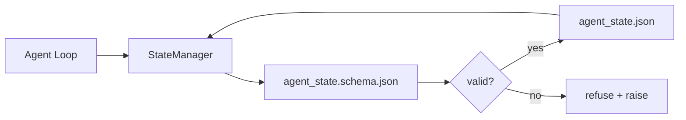

# 仓库记忆与持久状态

> 聊天记录是易失的。仓库是持久的。工作台将智能体状态存储在版本化的文件中，以便下一个会话、下一个智能体和下一个审查者都从同一真实来源读取。

**类型：** Build
**语言：** Python（stdlib + `jsonschema` 可选）
**前置条件：** 阶段 14 · 32（最小化工作台）
**时间：** 约 60 分钟

## 学习目标

- 定义哪些内容属于仓库记忆，哪些属于聊天历史。
- 为 `agent_state.json` 和 `task_board.json` 编写 JSON Schema。
- 构建一个状态管理器，用于加载、验证、变更和原子性地持久化状态。
- 使用 schema 在错误写入破坏工作台之前拒绝它们。

## 问题描述

智能体完成了一个会话。聊天关闭了。下一个会话打开，询问从哪里开始。模型说"让我检查一下文件"，读取过时的笔记，并重复已经完成的工作。或者更糟的是，由于没有人告诉它文件已完成，它重写了一个已完成的文件。

工作台的解决方案是仓库记忆：状态以 JSON 文件的形式存在于仓库中，按照 schema 编写，原子性持久化，在代码审查中便于 diff。聊天是临时的流；仓库是记录系统。

## 核心概念



### 什么属于仓库记忆

| 属于 | 不属于 |
|------|--------|
| 当前任务 ID | 原始聊天记录 |
| 本次会话访问过的文件 | Token 级别的推理轨迹 |
| 智能体做出的假设 | "用户看起来很沮丧" |
| 未解决的阻塞问题 | 采样结果 |
| 下一步行动 | 供应商特定的模型 ID |

判断标准是持久性：这在三个月后的 CI 重跑中会有用吗？如果有，放入仓库。如果没有，放入遥测数据。

### Schema 优先的状态管理

JSON Schema 是契约。没有它，每个智能体都会发明新字段，每个审查者都要学习新的结构，每个 CI 脚本都必须对过去的版本做特殊处理。有了它，错误的写入会被拒绝。

Schema 涵盖：

- 必需的键。
- 允许的 `status` 值。
- 禁止的值（例如数组的 `null`）。
- 模式约束（任务 ID 匹配 `T-\d{3,}`）。
- 用于迁移的版本字段。

### 原子写入

状态写入需要能够承受部分失败：写入临时文件，执行 fsync，然后重命名覆盖目标文件。状态文件是真实来源；一个写了一半的文件比没有文件更糟糕。

### 迁移

当 schema 发生变化时，在 schema 升级旁边附上迁移脚本。状态文件包含一个 `schema_version` 字段；管理器会拒绝加载它无法迁移的版本的文件。

## 构建它

`code/main.py` 实现了：

- `agent_state.schema.json` 和 `task_board.schema.json`。
- 一个仅使用标准库的验证器（JSON Schema 的子集：required、type、enum、pattern、items）。
- `StateManager.load`、`StateManager.update`、`StateManager.commit`，支持原子性的临时文件加重命名写入。
- 一个演示，展示状态变更、持久化、重新加载并证明往返过程。

运行它：

```
python3 code/main.py
```

该脚本写入 `workdir/agent_state.json` 和 `workdir/task_board.json`，在两轮中对它们进行变更，并在每个步骤打印验证后的状态。

## 生产环境中的模式

四种模式将课程中的最小实现变成一个多智能体 monorepo 可以承受的东西。

**原子性临时文件加重命名不是可选的。** 2026 年 3 月 Hive 项目的一个 bug 报告清晰地记录了这种故障模式：`state.json` 通过 `write_text()` 写入，异常被捕获并静默处理。部分写入导致会话在损坏的状态下恢复，没有任何信号。解决方案始终是：在目标目录中使用 `tempfile.mkstemp`，写入，执行 `fsync`，然后调用 `os.replace`（在 POSIX 和 Windows 上都是原子重命名）。本课程的 `atomic_write` 正是这样做的。

**对每个非幂等的工具调用使用幂等键。** 如果智能体在调用工具后但在检查点保存结果之前崩溃，恢复时会重试该工具调用。这对读取是安全的；但对电子邮件、数据库插入、文件上传是危险的。模式是：在执行前将每个工具调用 ID 记录到 `pending_calls.jsonl`。重试时，检查该 ID 是否存在；如果存在，跳过调用并使用缓存的结果。Anthropic 和 LangChain 在 2026 年的指南中都强调了这一点；LangGraph 的检查点持久化器出于同样的原因保留待处理的写入。

**将大型工件与状态分开。** 不要在 `agent_state.json` 中存储 CSV、长转录文本或生成的文件。将工件保存为单独的文件（或上传到对象存储），只在状态中保留路径。检查点保持小巧快速；工件可以独立增长。

**事件溯源用于审计，快照用于恢复。** 在每次变更时追加到事件日志（`state.events.jsonl`）；定期快照到 `state.json`。恢复时读取快照，然后重放快照时间戳之后的任何事件。这会消耗更多磁盘空间，但让你可以逐字重放智能体的决策——在调试长时间运行的任务时至关重要。这与 Postgres 内部用于 WAL 的结构相同。

**Schema 迁移或拒绝加载。** `schema_version` 整数是契约。当管理器加载一个未知版本的文件时，它会拒绝读取。在 schema 升级旁边附上迁移脚本；`tools/migrate_state.py` 在每次启动时幂等地运行。

## 使用它

在生产环境中：

- **LangGraph 检查点持久化器。** 相同的理念，不同的存储。检查点持久化器将图状态保存到 SQLite、Postgres 或自定义后端。当检查点持久化器失效，你需要手动读取状态时，本课程教授的 schema 就是你需要的工具。
- **Letta 记忆块。** 具有结构化 schema 的持久化块（阶段 14 · 08）。相同的规范，应用于长时间运行的角色。
- **OpenAI Agents SDK 会话存储。** 可插拔的后端，支持 schema。本课程中的状态文件就是本地文件后端。

## 交付它

`outputs/skill-state-schema.md` 生成项目特定的 JSON Schema 对（状态 + 看板）、一个连接到原子写入的 Python `StateManager`，以及一个迁移脚手架，以便下次 schema 升级不会破坏工作台。

## 练习

1. 添加一个 `last_human_touch` 时间戳。拒绝在人类编辑后五秒内的任何智能体写入。
2. 扩展验证器以支持 `oneOf`，使任务可以是构建任务或审查任务，具有不同的必需字段。
3. 添加 `schema_version` 字段并编写从 v1 到 v2 的迁移（将 `blockers` 重命名为 `risks`）。
4. 将存储后端从本地文件迁移到 SQLite。保持 `StateManager` API 不变。
5. 用两个智能体在 50 毫秒的写入竞争中同时操作同一个状态文件。会发生什么问题？原子重命名如何拯救你？

## 关键术语

| 术语 | 人们怎么说 | 实际含义 |
|------|-----------|----------|
| 仓库记忆 | "笔记文件" | 存储在仓库中受跟踪文件里的状态，遵循 schema |
| Schema 优先 | "验证输入" | 在编写者之前定义契约，拒绝漂移 |
| 原子写入 | "直接重命名" | 写入临时文件，fsync，重命名，使部分失败无法造成损坏 |
| 迁移 | "Schema 升级" | 将 vN 状态转换为 v(N+1) 状态的脚本 |
| 记录系统 | "真实来源" | 工作台视为权威的工件 |

## 延伸阅读

- [JSON Schema 规范](https://json-schema.org/specification.html)
- [LangGraph 检查点持久化器](https://langchain-ai.github.io/langgraph/concepts/persistence/)
- [Letta 记忆块](https://docs.letta.com/concepts/memory)
- [Fast.io，AI 智能体状态检查点：实用指南](https://fast.io/resources/ai-agent-state-checkpointing/) —— schema 优先的检查点与幂等性
- [Fast.io，AI 智能体工作流状态持久化：2026 年最佳实践](https://fast.io/resources/ai-agent-workflow-state-persistence/) —— 并发控制、TTL、事件溯源
- [Hive Issue #6263 —— 非原子性 state.json 写入被静默忽略](https://github.com/aden-hive/hive/issues/6263) —— 真实项目中的故障模式
- [eunomia，检查点/恢复系统：演进、技术与应用](https://eunomia.dev/blog/2025/05/11/checkpointrestore-systems-evolution-techniques-and-applications-in-ai-agents/) —— 从操作系统历史中提炼出的检查点原语应用于智能体
- [Indium，2026 年长期运行 AI 智能体的 7 种状态持久化策略](https://www.indium.tech/blog/7-state-persistence-strategies-ai-agents-2026/)
- [Microsoft Agent Framework，压缩](https://learn.microsoft.com/en-us/agent-framework/agents/conversations/compaction) —— 供应商检查点管理器
- 阶段 14 · 08 —— 记忆块与睡眠时间计算
- 阶段 14 · 32 —— 本课程将其 schema 化的三文件最小实现
- 阶段 14 · 40 —— 从相同 schema 读取的交接包
