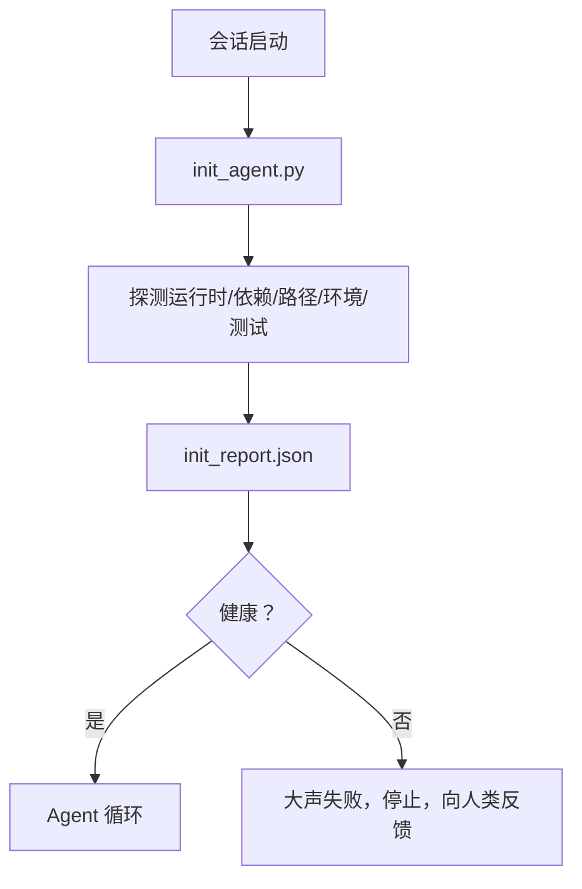

# Agent 初始化脚本

> 每次冷启动的会话都要付出税赋。Agent 读取相同的文件，重试相同的探测，重新发现相同的路径。初始化脚本一次性支付税赋，并将答案写入状态。

**类型：** 构建
**语言：** Python（标准库）
**前置条件：** 阶段 14 · 32（最小工作台），阶段 14 · 34（仓库记忆）
**时间：** 约 45 分钟

## 学习目标

- 识别 Agent 每次会话都不应重复执行的工作。
- 构建一个确定性初始化脚本，探测运行时、依赖和仓库健康状况。
- 持久化探测结果，让 Agent 直接读取而非重新运行检查。
- 失败时要大声、快速、且只看一个地方就能定位问题。

## 问题所在

打开一个会话。Agent 猜测 Python 版本。猜测测试命令。列出仓库根目录五次以找到入口点。尝试导入一个未安装的包。询问用户配置文件在哪里。当它终于做出真正的编辑时，一万 token 已经耗在了本该是一次脚本完成的设置工作上。

修复方法是运行一个初始化脚本，在 Agent 执行任何其他操作之前运行，并将 `init_report.json` 写入，Agent 在启动时读取它。

## 概念



### 初始化脚本探测什么

| 探测项 | 为什么重要 |
|-------|-----------|
| 运行时版本 | 错误的 Python 或 Node 版本会导致静默的版本错误 |
| 依赖可用性 | 缺少的包后期修复成本是现在发现的十倍 |
| 测试命令 | Agent 必须知道如何验证；如果命令缺失，工作台就是坏的 |
| 仓库路径 | 硬编码路径会漂移；解析一次并固定 |
| 环境变量 | 缺少 `OPENAI_API_KEY` 是失败面，而非运行时谜团 |
| 状态和看板新鲜度 | 崩溃会话的陈旧状态是绊脚石 |
| 上次已知良好提交 | 为会话结束时的交接差异提供锚点 |

### 大声失败，快速失败，只在一个地方失败

探测失败意味着停止并向人类反馈。不要指望"Agent 会自己搞定"。初始化的全部意义就在于当工作台损坏时拒绝启动。

### 幂等性

连续运行两次。第二次运行除了时间戳刷新外应该是无操作的。幂等性使得你可以将脚本接入 CI、钩子或预任务斜杠命令。

### 初始化 vs 启动规则

规则（阶段 14 · 33）描述了行动必须满足的条件。初始化是建立这些规则可被检查的脚本。规则没有初始化就变成了"小心点"。初始化没有规则就变成了漂亮的失败。

## 构建它

`code/main.py` 实现了 `init_agent.py`：

- 五个探测：Python 版本、通过 `importlib.util.find_spec` 列出依赖、测试命令可解析性、必需环境变量、状态文件新鲜度。
- 每个探测返回 `(name, status, detail)`。
- 脚本写入 `init_report.json`，包含完整探测集，如果任何阻塞严重性探测失败则以非零退出。

运行它：

```
python3 code/main.py
```

脚本打印探测表，写入 `init_report.json`，在正常路径以零退出，或在有失败探测时以非零退出并列出失败探测。

## 生产环境中的常见模式

三个模式将有用的初始化脚本与仪式区分开来。

**上次已知良好提交锚定。** 将当前提交与上次成功合并时写入的 `LKG` 文件进行差异比较。如果差异超过预算（默认 50 个文件），拒绝启动并要求人类确认新基线。这就是 Cloudflare AI Code Review 用于限定审查 Agent 范围的方式：每个审查会话都锚定于相同的上次已知良好点，不会在会话间累积漂移。

**带 TTL 的锁文件。** 首次探测通过后写入 `prereqs.lock`。后续运行在 N 小时（默认 24 小时）内信任锁文件并跳过昂贵的探测。初始化脚本首先读取锁文件；如果锁文件新鲜且依赖清单哈希匹配，则短路。这与 Docker 用于层缓存的模式相同：幂等探测 + 内容哈希 = 跳过。

**热路径中无网络、无 LLM、无意外。** 初始化探测是确定性管道。调用 LLM 对失败进行分类或调用外部服务检查许可证的探测不是探测；它是工作流。如果一个探测在空运行中超过三秒，将其视为工作台异味，并将其移出初始化或缓存结果。

## 使用它

在生产环境中：

- **Claude Code 钩子。** `pre-task` 钩子调用初始化脚本，如果失败则拒绝启动 Agent。
- **GitHub Actions。** `setup-agent` 作业运行初始化脚本；Agent 作业依赖于它。
- **Docker 入口点。** Agent 容器在执行 Agent 运行时之前运行初始化脚本；失败时日志可见。

初始化脚本是可移植的，因为它不调用特定框架。Bash、Make 或任务文件都可以包装它。

## 交付它

`outputs/skill-init-script.md` 询问项目，将设置工作分类为探测，并发出项目特定的 `init_agent.py` 和在任何 Agent 步骤之前运行它的 CI 工作流。

## 练习

1. 添加一个探测，将当前提交与上次已知良好提交进行差异比较，如果超过 50 个文件变更则拒绝启动。
2. 将脚本连接到写入 `prereqs.lock` 文件，如果锁文件超过七天则拒绝启动。
3. 添加 `--fix` 标志，自动安装缺少的开发依赖，但未经批准绝不修改运行时依赖。
4. 将探测从硬编码函数移至 YAML 注册表。讨论权衡。
5. 为每个探测添加时间预算。运行超过三秒的探测是工作台异味。

## 关键术语

| 术语 | 人们怎么说 | 实际含义 |
|------|-----------|----------|
| 探测（Probe） | "一个检查" | 返回 `(name, status, detail)` 的确定性函数 |
| 初始化报告（Init report） | "设置输出" | 在状态旁边写入的包含探测结果的 JSON |
| 幂等（Idempotent） | "可以安全重新运行" | 连续两次运行产生除时间戳外完全相同的报告 |
| 大声失败（Fail loud） | "不要吞掉错误" | 停止并向人类反馈；不静默回退 |
| 设置税（Setup tax） | "引导成本" | Agent 每次会话重新发现明显信息所花费的 token |

## 延伸阅读

- [Anthropic, Effective harnesses for long-running agents](https://www.anthropic.com/engineering/effective-harnesses-for-long-running-agents)
- [GitHub Actions, composite actions for setup](https://docs.github.com/en/actions/sharing-automations/creating-actions/creating-a-composite-action)
- [microservices.io, GenAI dev platform: guardrails](https://microservices.io/post/architecture/2026/03/09/genai-development-platform-part-1-development-guardrails.html) — pre-commit + CI 检查作为初始化
- [Augment Code, How to Build Your AGENTS.md (2026)](https://www.augmentcode.com/guides/how-to-build-agents-md) — 初始化期望
- [Codex Blog, Codex CLI Context Compaction](https://codex.danielvaughan.com/2026/03/31/codex-cli-context-compaction-architecture/) — 会话启动作为压缩感知初始化
- 阶段 14 · 33 — 该脚本启用的规则集
- 阶段 14 · 34 — 该脚本种子化的状态文件
- 阶段 14 · 38 — 初始化脚本供给的验证门
- 阶段 14 · 40 — 消费初始化报告上次已知良好的交接
