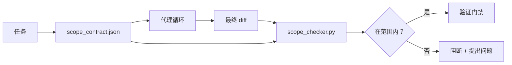

# 范围契约与任务边界

> 模型不知道工作在哪里结束。范围契约是一份每个任务独立的文件，它规定了工作从哪里开始、在哪里结束，以及如果工作溢出时如何回滚。这份契约将"保持在范围内"从一个愿望变成了一个可检查的项。

**类型：** Build
**语言：** Python (stdlib)
**前置条件：** Phase 14 · 32（最小工作台），Phase 14 · 33（规则即约束）
**时间：** ~50 分钟

## 学习目标

- 编写一份范围契约，让代理在任务开始时读取，验证器在任务结束时读取。
- 指定允许的文件、禁止的文件、验收标准、回滚计划和审批边界。
- 实现一个范围检查器，将 diff 与契约进行比较并标记违规行为。
- 让范围蔓延变得可见、自动化且可审查。

## 问题

代理会蔓延。任务是"修复登录 bug"。diff 涉及登录路由、邮件助手、数据库驱动、README 和发布脚本。每一次涉及在当时都有合理的理由。但合在一起，它们是一个与被审查的内容不同的变更。

范围蔓延是代理工作中最缺乏监控的失败模式，因为代理会真诚地叙述每一步。修复方法不是更严格的提示词。修复方法是磁盘上的一份契约，说明承诺了什么，以及将结果与承诺进行比较的检查。

## 概念



### 范围契约中应包含什么

| 字段 | 用途 |
|------|------|
| `task_id` | 关联看板上的任务 |
| `goal` | 一句话，审查者可以验证 |
| `allowed_files` | 代理可以写入的 glob 模式 |
| `forbidden_files` | 代理绝不能触碰的 glob 模式，即使意外也不行 |
| `acceptance_criteria` | 测试命令或断言行，证明任务完成 |
| `rollback_plan` | 一段操作员在需要停止时可以执行的文字 |
| `approvals_required` | 范围外需要明确人工批准的操作 |

没有 `forbidden_files` 的契约是不完整的。负空间是契约的一半。

### 使用 glob，而非原始路径

真实仓库会移动文件。将契约固定到 glob 模式（`app/**/*.py`、`tests/test_signup*.py`），这样会话之间的重构不会使契约失效。

### 回滚是范围的一部分

列出如何回滚会迫使契约作者思考可能出什么问题。一份你无法回滚的契约，是一份不应该被批准的契约。

### 范围检查就是 diff 检查

代理写入 diff。检查器读取 diff、允许的 glob 模式、禁止的 glob 模式，以及任何已运行的验收命令列表。每一条违规都是一个带标签的发现，验证门禁可以拒绝。

### 范围的两个层级：功能列表和任务契约

范围契约约束的是单个任务，而不是整个项目。一个代理可以完美地待在登录修复的契约内，然后在下一轮又决定项目还需要一个设置页面、一个深色模式切换器和一个路由器的重写。契约从未被询问项目中哪些工作在范围内，只询问了任务中哪些文件在范围内。

第二个层级需要自己的基本结构：一个代理在会话开始时读取的 `feature_list.json`。它是以机器可读、有序文件形式存在的项目待办事项列表。代理选择一个 `status` 为 `todo` 的功能，将其 `id` 写入活动的范围契约中，并且被禁止在同一会话中开始第二个功能。"一次只做一个功能"不再是一行代理可以合理化绕过的提示词，而是一个它从磁盘读取的值和一个门禁强制执行的检查。

```json
{
  "project": "knowledge-base",
  "active": "import-pdf",
  "features": [
    { "id": "import-pdf",   "status": "in_progress", "goal": "import a PDF into the library",        "done_when": "pytest tests/test_import.py && a sample PDF appears in the library view" },
    { "id": "full-text-search", "status": "todo",     "goal": "search document text and rank hits",   "done_when": "query returns ranked results with snippets" },
    { "id": "cite-answers", "status": "todo",         "goal": "answers carry source citations",        "done_when": "every answer renders at least one clickable citation" }
  ]
}
```

| 字段 | 用途 |
|------|------|
| `active` | 当前会话可以触及的唯一功能；为空则表示选择一个并设置它 |
| `features[].id` | 范围契约的 `task_id` 指向的稳定标识 |
| `features[].status` | `todo`、`in_progress`、`done`、`blocked`；同一时间只能有一个 `in_progress` |
| `features[].goal` | 一句话，审查者可以验证 |
| `features[].done_when` | 将 `in_progress` 翻转为 `done` 的验收行 |

两个规则使这份列表成为承重结构而非装饰品。首先，"最多一个 `in_progress`" 的不变式本身就是一个启动检查（Phase 14 · 33）：如果列表显示两个，会话将拒绝启动，直到人工解决。其次，功能列表是一个文件，而不是聊天消息，因为聊天消息会滚动出上下文，而文件在跨会话和跨代理时持久存在。交接机制（Phase 14 · 40）会将已完成功能的状态写回 `done`，这样下一个会话打开时看到的是一个准确的看板，而不是重新推导还剩什么。

契约和列表通过最小权限原则进行组合，即下面描述的相同合并方式：任务契约的 `allowed_files` 必须位于活动功能所触及的范围内，绝不能超出。

## 构建它

`code/main.py` 实现了：

- `scope_contract.json` 模式（JSON Schema 的子集，glob 数组）。
- 一个 diff 解析器，将触及的文件列表加上运行的命令列表转换为 `RunSummary`。
- 一个 `scope_check`，根据契约返回 `(violations, in_scope, off_scope)`。
- 两个演示运行：一个保持在范围内，一个蔓延了。检查器标记了蔓延的确切文件和原因。

运行它：

```
python3 code/main.py
```

输出：契约、两次运行、每次运行的判定结果，以及保存的 `scope_report.json`。

## 生产环境中的模式

一位实践者运行 "specsmaxxing"（在调用代理之前用 YAML 编写范围契约）报告称，三周内兔子洞率从 52% 降至 21%，且未更改代理。是契约完成了工作，而不是模型。三个模式使收益持续。

**违规预算，而非二进制失败。** `agent-guardrails`（Claude Code、Cursor、Windsurf、Codex 通过 MCP 使用的开源合并门禁）为每个任务提供 `violationBudget`：预算内的轻微范围偏差以警告形式呈现；只有当预算被超出时，合并门禁才会拒绝。配合 `violationSeverity: "error" | "warning"` 使用。预算是一个门禁能交付还是被讨厌它的团队禁用的区别。

**按路径族的严重性不对称。** 对 `docs/**` 的范围外写入通常是 `warn`；对 `scripts/**`、`migrations/**`、`config/prod/**` 的范围外写入总是 `block`。这种不对称性必须存在于契约中，而不是运行时中，因为它是特定于项目的，且因任务而异。

**时间和网络预算与文件预算并列。** `time_budget_minutes` 字段限制挂钟时间；运行时在超过该时间后拒绝继续，除非重新获得批准。`network_egress` 主机名白名单防止代理悄悄访问任务之外的外部 API。这些也是范围维度；文件 glob 是必要的，但不充分。

**多契约合并语义（最小权限）。** 当两个范围契约同时适用时（例如，项目级契约加任务级契约），合并规则是：**交集** `allowed_files`（两个契约都必须允许该路径），**并集** `forbidden_files`（任一契约可以禁止），`time_budget_minutes` 取最严格的（最小值），`approvals_required` 累加。`network_egress` 为 `None` 表示不强制执行，`[]` 表示拒绝全部，`[...]` 作为白名单；在合并时，`None` 延迟到另一方，两个列表取交集，拒绝全部保持拒绝全部。在契约模式中声明这一点，使合并机械化且可审查。

## 使用它

生产模式：

- **Claude Code 斜杠命令。** `/scope` 命令写入契约并将其固定为会话上下文。子代理在执行前读取契约。
- **GitHub PR。** 将契约作为 JSON 文件推送到 PR 正文中或作为已签入的产物。CI 对合并 diff 运行范围检查器。
- **LangGraph 中断。** 范围违规触发中断；处理器询问人工是否需要扩大契约还是代理需要退缩。

契约随任务一起流转。当任务关闭时，契约归档在 `outputs/scope/closed/` 下。

## 交付它

`outputs/skill-scope-contract.md` 根据任务描述生成范围契约，以及一个在每次代理 diff 上在 CI 中运行的 glob 感知检查器。

## 练习

1. 添加一个 `network_egress` 字段，列出允许的外部主机。拒绝访问其他主机的运行。
2. 扩展检查器，对 `docs/**` 软失败，对 `scripts/**` 硬失败。解释不对称的理由。
3. 让契约使用静态规则集（不用 LLM）从 `goal` 字段推导 `allowed_files`。第一个边界情况会出什么问题？
4. 添加 `time_budget_minutes`，并在挂钟时间超过后拒绝继续。
5. 对同一个 diff 运行两个契约。当两者都适用时，正确的合并语义是什么？

## 关键术语

| 术语 | 人们的说法 | 实际含义 |
|------|-----------|---------|
| 范围契约 | "任务简报" | 每个任务独立的 JSON，列出允许/禁止的文件、验收标准、回滚计划 |
| 范围蔓延 | "它还触及了..." | 在同一任务中更改了契约外的文件 |
| 回滚计划 | "我们可以回滚" | 用于停止操作的一段操作员手册 |
| 审批边界 | "需要签字" | 契约中列为需要明确人工批准的操作 |
| Diff 检查 | "路径审计" | 将触及的文件与契约 glob 进行比较 |

## 延伸阅读

- [LangGraph human-in-the-loop interrupts](https://langchain-ai.github.io/langgraph/concepts/human_in_the_loop/)
- [OpenAI Agents SDK tool approval policies](https://platform.openai.com/docs/guides/agents-sdk)
- [logi-cmd/agent-guardrails — merge gates and scope validation](https://github.com/logi-cmd/agent-guardrails) — violation budgets, severity tiers
- [Dev|Journal, Preventing AI Agent Configuration Drift with Agent Contract Testing](https://earezki.com/ai-news/2026-05-05-i-built-a-tiny-ci-tool-to-keep-ai-agent-configs-from-drifting-in-my-repo/) — `--strict` mode without external deps
- [Agentic Coding Is Not a Trap (production logs)](https://dev.to/jtorchia/agentic-coding-is-not-a-trap-i-answered-the-viral-hn-post-with-my-own-production-logs-33d9) — specsmaxxing receipts: 52% → 21%
- [OpenCode permission globs](https://opencode.ai/docs/agents/) — fine-grained per-permission scope
- [Knostic, AI Coding Agent Security: Threat Models and Protection Strategies](https://www.knostic.ai/blog/ai-coding-agent-security) — scope as part of least privilege
- [Augment Code, AI Spec Template](https://www.augmentcode.com/guides/ai-spec-template) — three-tier boundary system (must/ask/never)
- Phase 14 · 27 — 与范围锁定配对的提示注入防御
- Phase 14 · 33 — 这份契约按任务特化的规则集
- Phase 14 · 36 — 检查器报告的验证门禁
