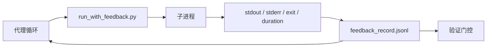

# 运行时反馈循环

> 无法看到真实命令输出的代理只能猜测。反馈运行器会捕获标准输出、标准错误、退出码和耗时，将其整理为结构化记录，供下一个轮次读取。代理因此可以对事实做出反应，而非对自己的猜测做出反应。

**类型：** 构建
**语言：** Python（标准库）
**前置条件：** 第 14 阶段 · 32（最小化工作台），第 14 阶段 · 35（初始化脚本）
**时间：** ~50 分钟

## 学习目标

- 区分运行时反馈与可观测性遥测。
- 构建一个包装 shell 命令并持久化结构化记录的反馈运行器。
- 确定性地截断大输出，使循环保持在令牌预算内。
- 当反馈缺失时拒绝推进循环。

## 问题描述

代理说"现在开始运行测试"。下一条消息说"所有测试通过"。但实际上根本没有任何测试运行。代理虚构了输出，或者运行了命令却没有读取结果，或者读取了结果却悄悄截断了失败行。

反馈运行器消除了这一鸿沟。每个命令都通过运行器执行。每条记录都包含命令、捕获的标准输出和标准错误、退出码、运行时间以及一行代理备注。代理在下一个轮次读取该记录。验证门控在任务结束时读取这些记录。

## 核心概念



### 反馈记录中包含什么

| 字段 | 重要性 |
|-------|----------------|
| `command` | 精确的 argv，无 shell 展开意外 |
| `stdout_tail` | 最后 N 行，确定性截断 |
| `stderr_tail` | 最后 N 行，与 stdout 分离 |
| `exit_code` | 明确的成功信号 |
| `duration_ms` | 暴露慢速探测和失控进程 |
| `started_at` | 用于回放的时间戳 |
| `agent_note` | 代理写的一行预期描述 |

### 截断是确定性的

50 MB 的日志会摧毁循环。运行器通过 `...truncated N lines...` 标记对头部和尾部进行确定性截断，相同输出总是产生相同记录。不进行采样；代理需要看到的部分（最终错误、最终摘要）位于尾部。

### 反馈与遥测

遥测（第 14 阶段 · 23，OTel GenAI 约定）用于操作员跨时间审查运行情况。反馈用于本次运行的下一个轮次。它们共享字段，但存储在不同的文件中，保留策略也不同。

### 没有反馈则拒绝推进

如果运行器在捕获退出码之前出错，记录会携带 `exit_code: null` 和 `error: <reason>`。代理循环必须拒绝在 `exit_code` 为 null 时声称成功。没有退出码，就没有进展。

## 构建

`code/main.py` 实现了：

- `run_with_feedback(command, agent_note)` 包装 `subprocess.run`，捕获 stdout/stderr/exit/duration，确定性截断，并追加到 `feedback_record.jsonl`。
- 一个将 JSONL 流式读入 Python 列表的小型加载器。
- 一个运行三个命令（成功、失败、慢速）并为每个命令打印最后一条记录的演示程序。

运行方法：

```
python3 code/main.py
```

输出：三条反馈记录追加到 `feedback_record.jsonl`，每条记录的最后一条内联打印。在多次运行中跟踪该文件，可以看到循环如何累积。

## 生产环境中的模式

三种模式足以使运行器达到可上线的健壮程度。

**在写入时脱敏，而非读取时。** 任何涉及 stdout 或 stderr 的记录都可能泄露机密。运行器在 JSONL 追加之前进行脱敏：剥离匹配 `^Bearer `、`password=`、`api[_-]?key=`、`AKIA[0-9A-Z]{16}`（AWS）、`xox[baprs]-`（Slack）的行。读取时脱敏是危险的；磁盘上的文件是攻击者可以访问的。每季度根据生产运行时观测到的机密格式审核脱敏模式。

**轮转策略，而非单一文件。** 将 `feedback_record.jsonl` 限制在每个文件 1 MB；溢出时轮转到 `.1`、`.2`，丢弃 `.5`。代理的循环只读取当前文件，因此运行时开销是有界的。CI 制品存储保存完整的轮转集。如果没有轮转，文件会成为每次加载器调用的瓶颈。

**父命令 ID 用于重试链。** 每条记录都获得 `command_id`；重试携带 `parent_command_id` 指向前一次尝试。审查者的"失败尝试"列表（第 14 阶段 · 40）和验证门控的审计都会跟踪该链条。没有此链接，重试看起来像独立的成功，审计会隐藏失败历史。

## 使用

生产环境模式：

- **Claude Code Bash 工具。** 该工具已经捕获 stdout、stderr、exit 和 duration。本课中的运行器是适用于任何代理产品的框架无关等价物。
- **LangGraph 节点。** 将任何 shell 节点包装在运行器中，使记录持久化到图状态之外。
- **CI 日志。** 将 JSONL 管道到 CI 制品存储；审查者无需重新运行会话即可回放任何命令。

运行器是一个薄包装器，可以在每次框架迁移中存活下来，因为它拥有记录的形状。

## 发布

`outputs/skill-feedback-runner.md` 生成项目特定的 `run_with_feedback.py`，包含正确的截断预算、连接到工作台的 JSONL 写入器，以及代理在每个轮次读取的加载器。

## 练习

1. 为每条记录添加 `cwd` 字段，以便从不同目录运行的同一命令可以区分。
2. 添加一个 `redaction` 步骤，剥离匹配 `^Bearer ` 或 `password=` 的行。在测试记录上进行测试。
3. 通过轮转到 `.1`、`.2` 文件，将 `feedback_record.jsonl` 总大小限制在 1 MB。论证轮转策略的合理性。
4. 添加 `parent_command_id`，使重试链可见：哪个命令产生了下一个命令消费的输入。
5. 将 JSONL 管道到一个小型 TUI，高亮显示最新的非零退出码。TUI 必须显示的八个关键特性才能在审查中有用。

## 关键术语

| 术语 | 通俗说法 | 实际含义 |
|------|----------------|------------------------|
| 反馈记录 | "运行日志" | 包含命令、输出、退出码、耗时的结构化 JSONL 条目 |
| 尾部截断 | "裁剪日志" | 确定性的头部+尾部捕获，使记录符合令牌预算 |
| 空值拒绝 | "阻止缺失数据" | 当 `exit_code` 为 null 时循环不得推进 |
| 代理备注 | "预期标签" | 代理在读取结果之前写的一行预期描述 |
| 遥测拆分 | "两个日志文件" | 反馈用于下一个轮次，遥测用于操作员 |

## 延伸阅读

- [OpenTelemetry GenAI 语义约定](https://opentelemetry.io/docs/specs/semconv/gen-ai/)
- [Anthropic，长时间运行代理的有效工具](https://www.anthropic.com/engineering/effective-harnesses-for-long-running-agents)
- [Guardrails AI x MLflow — 确定性安全、PII、质量验证器](https://guardrailsai.com/blog/guardrails-mlflow) — 脱敏模式作为回归测试
- [Aport.io，2026 年最佳 AI 代理防护栏：预动作授权对比](https://aport.io/blog/best-ai-agent-guardrails-2026-pre-action-authorization-compared/) — 预/后工具捕获
- [Andrii Furmanets，2026 年的 AI 代理：工具、记忆、评估、防护栏的实用架构](https://andriifurmanets.com/blogs/ai-agents-2026-practical-architecture-tools-memory-evals-guardrails) — 可观测性表面
- 第 14 阶段 · 23 — 遥测方面的 OTel GenAI 约定
- 第 14 阶段 · 24 — 代理可观测性平台（Langfuse、Phoenix、Opik）
- 第 14 阶段 · 33 — 要求在声明完成前提供反馈的规则
- 第 14 阶段 · 38 — 读取 JSONL 的验证门控
