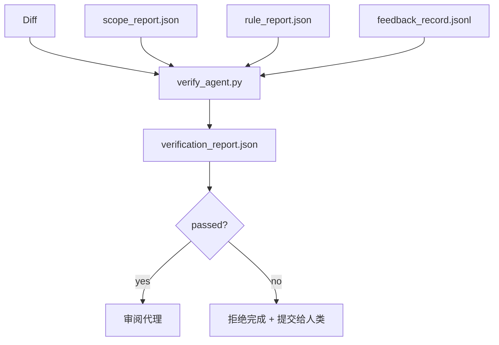

# 验证关卡

> 代理不能把自己的工作标记为完成。验证关卡会读取范围契约、反馈日志、规则报告和 diff，然后回答一个简单的问题：这项任务真的完成了吗？如果关卡说"没完成"，那么任务就没有完成，无论聊天中怎么说。

**类型：** 构建
**语言：** Python（标准库）
**前置条件：** 第 14 阶段 · 33（规则）、第 14 阶段 · 36（范围）、第 14 阶段 · 37（反馈）
**时间：** 约 55 分钟

## 学习目标

- 将验证关卡定义为工作台产物上的确定性函数。
- 将规则报告、范围报告、反馈记录和 diff 合并为一个判定结果。
- 生成 `verification_report.json`，供审阅代理和 CI 读取。
- 在任何 block 级别的失败面前，绝对不能推进任务，没有例外。

## 问题所在

代理太容易宣布成功了。有三种典型的失败模式：

- "看起来不错。"模型读了自己的 diff，然后判定它是正确的。
- "测试通过了。"自信地说。但没有测试实际运行的记录。
- "验收标准已满足。"验收标准被宽泛地解读，以至于"任何看起来像完成的东西"都算满足。

工作台的解决方案是一个验证关卡，它读取代理已产生的产物并做出判断。关卡是确定性的。关卡在版本控制中。关卡被接入 CI。代理无法贿赂它。

## 核心概念



### 关卡检查的内容

| 检查项 | 来源产物 | 严重级别 |
|-------|----------|----------|
| 所有验收命令都已运行 | `feedback_record.jsonl` | block |
| 所有验收命令退出码为零 | `feedback_record.jsonl` | block |
| 范围检查没有禁止的写入 | `scope_report.json` | block |
| 范围检查没有越界的写入 | `scope_report.json` | block 或 warn |
| 所有 block 级别的规则都通过 | `rule_report.json` | block |
| 反馈中没有 `null` 退出码 | `feedback_record.jsonl` | block |
| 被修改的文件匹配 `scope.allowed_files` | 两者 | warn |

`warn` 结果会标注到判定中；`block` 结果会阻止 `passed: true`。

### 确定性，而非概率性

关卡必须对相同的产物集每次产生相同的判定。不能使用 LLM 判断。LLM 判断属于审阅端（第 14 阶段 · 39），那里的目标是定性评估，而不是状态判断。

### 一份报告，一条路径

关卡每次任务关闭时生成一份 `verification_report.json`，写入 `outputs/verification/<task_id>.json`。CI 使用相同的路径。多个关卡使用不同路径会导致真实来源分叉。

### 无例外拒绝

block 级别的发现不能被代理覆盖。只能由人类覆盖，需要记录 `override_reason` 和 `overridden_by` 用户 ID。覆盖是签名变更，而不是代理决定。

## 动手构建

`code/main.py` 实现了：

- 每种输入产物的加载器，全部在本地存根化以使课程自包含。
- 一个 `verify(task_id, artifacts) -> VerdictReport` 纯函数。
- 一个打印机，显示每项检查的结果和最终的通过/失败。
- 一个包含三个任务场景的演示：干净通过、范围蔓延、缺少验收。

运行方法：

```
python3 code/main.py
```

输出：三份判定报告，每份保存在脚本旁边。

## 生产环境中的实战模式

四种模式将关卡从"又一个 lint 任务"提升为"决策边缘"。

**纵深防御，而非单一关卡。** pre-commit hook → CI 状态检查 → 工具前授权 hook → 合并前关卡。每一层都是确定性的，这样一层的失败会被下一层捕获。microservices.io 2026 年 3 月的 playbook 明确指出：pre-commit hook 是不可绕过的，因为与模型端的技能不同，它不依赖代理遵循指令。验证关卡位于 CI / 合并前这一层。

**确定性检查做防御，模型判断只用于细微之处。** Anthropic 2026 年 Hybrid Norm 配对：可验证的奖励（单元测试、模式检查、退出码）回答"代码是否解决了问题？"— LLM 评分标准回答"代码是否可读、安全、符合风格？"关卡运行第一类；审阅者（第 14 阶段 · 39）运行第二类。混合使用会模糊信号。

**签名覆盖日志，而非 Slack 线程。** 每次覆盖都会在 `outputs/verification/overrides.jsonl` 中写入一行：时间戳、发现代码、原因、签名用户、当前 HEAD 提交。运行时拒绝任何缺少签名的覆盖；审计线索由 git 追踪。这是覆盖策略和覆盖表演之间的分界线。

**覆盖率下限作为一等检查。** `coverage_report.json` 提供 `coverage_floor`（默认 80%）检查。如果测量的覆盖率低于下限，或比上次合并的下限低超过 1 个百分点，关卡就会失败。没有这个检查，代理会悄悄删除失败的测试，而验证报告依然显示绿色。

**`--strict` 模式将 warn 提升为 block。** 对于发布分支、阻塞合并的 PR 或事后复盘，`--strict` 将每个警告变为硬失败。该标志按分支选择加入；不是全局默认，因为全面严格会腐蚀日常工作流。

## 使用方法

生产模式：

- **CI 步骤。** `verify_agent` 作业对代理的最终产物运行关卡。合并保护在没有 `passed: true` 时拒绝。
- **交接前 hook。** 代理运行时在生成交接文档前调用关卡。没有绿色判定，就没有交接。
- **手动分诊。** 当代理声称成功而人类怀疑时，操作员阅读报告。

关卡是工作台流程中的决策边缘。所有其他层面都在它之上。

## 交付

`outputs/skill-verification-gate.md` 将关卡接入特定项目：哪些验收命令馈送它，哪些规则是 block 级别，哪些越界写入被容忍，覆盖审计日志如何存储。

## 练习

1. 添加 `coverage_floor` 检查：测试命令必须生成至少 80% 覆盖率的覆盖率报告。决定哪个产物承载下限。
2. 支持 `--strict` 模式，将每个 `warn` 提升为 `block`。记录 strict 模式是正确默认值的场景。
3. 让关卡在 JSON 之外生成 Markdown 摘要。论证哪些字段应出现在摘要中。
4. 添加 `time_since_last_human_touch` 检查：在人类按键后 60 秒内编辑的任何文件都免除越界标记。
5. 对你产品中的真实代理 diff 运行关卡。有多少发现是真实的，有多少是噪音？关卡需要在哪些方面成长？

## 关键术语

| 术语 | 人们怎么说 | 实际含义 |
|------|-----------|---------|
| 验证关卡 | "阻止事情的检查" | 工作台产物上的确定性函数，产生通过/失败判定 |
| Block 严重级别 | "硬失败" | 阻止 `passed: true` 且需要签名覆盖的发现 |
| 覆盖日志 | "我们为什么让它通过" | 带有原因和用户 ID 的签名条目，经审查审计 |
| 验收命令 | "证据" | 退出码为零即为"完成"的 shell 命令 |
| 单一报告路径 | "真实来源" | `outputs/verification/<task_id>.json`，CI 和人类共同使用 |

## 延伸阅读

- [Anthropic, Harness design for long-running application development](https://www.anthropic.com/engineering/harness-design-long-running-apps)
- [OpenAI Agents SDK guardrails](https://platform.openai.com/docs/guides/agents-sdk/guardrails)
- [microservices.io, GenAI dev platform: guardrails](https://microservices.io/post/architecture/2026/03/09/genai-development-platform-part-1-development-guardrails.html) — pre-commit 和 CI 之间的纵深防御
- [ICMD, The 2026 Playbook for Agentic AI Ops](https://icmd.app/article/the-2026-playbook-for-agentic-ai-ops-guardrails-costs-and-reliability-at-scale-1776661990431) — 审批关卡阶梯（草稿 → 审批 → 阈值下自动）
- [Type-Checked Compliance: Deterministic Guardrails (arXiv 2604.01483)](https://arxiv.org/pdf/2604.01483) — Lean 4 作为确定性关卡的上界
- [logi-cmd/agent-guardrails — merge gate spec](https://github.com/logi-cmd/agent-guardrails) — 范围 + 变异测试关卡
- [Guardrails AI x MLflow](https://guardrailsai.com/blog/guardrails-mlflow) — 确定性验证器作为 CI 评分器
- [Akira, Real-Time Guardrails for Agentic Systems](https://www.akira.ai/blog/real-time-guardrails-agentic-systems) — 工具前/工具后关卡
- 第 14 阶段 · 27 — 提示注入防御（关卡的对抗搭档）
- 第 14 阶段 · 36 — 关卡执行的范围契约
- 第 14 阶段 · 37 — 关卡评分的反馈日志
- 第 14 阶段 · 39 — 关卡交接的审阅代理
