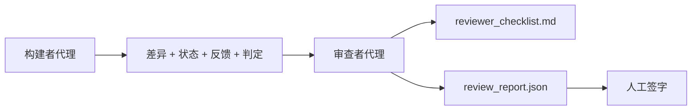

# 审查代理：将构建者与评审者分离

> 编写代码的代理无法为其评分。审查者是第二个循环，使用不同的系统提示、不同的目标，以及对构建者产出的所有内容的只读访问权限。构建者与审查者之间的差距正是大多数可靠性所在。

**类型：** 构建
**语言：** Python（标准库）
**前置条件：** 第14阶段 · 38（验证门）
**时间：** 约55分钟

## 学习目标

- 阐明为何同一代理无法可靠地审查其自身工作。
- 构建一个审查代理循环，该循环消耗构建者制品并生成结构化的审查报告。
- 编写一个审查评分标准，该标准针对特定维度进行评分，而非主观感受。
- 将审查者集成到工作台中，使人工审查步骤从一个真实制品开始。

## 问题

你要求代理修复一个 bug。它编辑了四个文件，运行了测试，并报告完成。验证门（第14阶段 · 38）确认验收已运行且范围保持。门显示 `passed: true`。你合并了代码。两天后，你发现这个修复只解决了 bug 的一半。

验收是必要的，但不充分。审查者提出验收无法提出的问题：这是否解决了正确的问题？它是否在未标记的情况下扩展了范围？它是否记录了本应被质疑的假设？它是否让工作台处于下一个会话可以接续的状态？

## 概念



### 审查者评分标准

五个维度，每个评分 0 到 2 分。

| 维度 | 问题 |
|------|------|
| 问题契合度 | 变更是否解决了所述任务，而非一个相近的任务？ |
| 范围纪律 | 编辑是否限制在合同范围内，或者合同是否被有意扩展？ |
| 假设 | 所有隐藏假设是否都记录在可审查的地方？ |
| 验证质量 | 验收命令是否确实证明了目标，还是证明了一个更弱的版本？ |
| 交接准备度 | 下一个会话能否从当前状态干净地接续？ |

总分10分。低于7分为软失败；低于5分为硬失败。

### 审查者是独立的角色，而非独立的模型

你可以使用与构建者相同的模型来运行审查者。纪律在于角色分离：不同的系统提示、不同的输入、对差异的无写入权限。姿态的改变就是信号的改变。

### 审查者无法编辑差异

审查者读取差异、状态、反馈和判定。它撰写报告。它不修补差异。如果报告说"修复这个"，下一个构建者回合进行修复；审查者则返回审查。混合角色会削弱差距。

### 审查者评分标准 vs. 验证门

验证门（第14阶段 · 38）检查确定性事实：验收是否运行，规则是否通过，范围是否保持。审查者做出定性判断：这项工作是否正确，是否有文档记录，交接是否可用。两者都是必需的。

## 构建它

`code/main.py` 实现：

- 一个 `ReviewerInputs` 数据类，捆绑审查者读取的制品。
- 一个评分标准评分器，每个维度一个函数。每个函数在本课中是确定性的且为桩实现；真实实现会调用 LLM。
- 一个 `review_report.json` 写入器，包含五个分数、总分和判定（`pass`、`soft_fail`、`hard_fail`）。
- 两个演示用例：一个干净的变更和一个"测试正确，问题错误"的变更。

运行它：

```
python3 code/main.py
```

输出：两个审查报告写入磁盘，以及一个维度分数的控制台表格。

## 现实中的生产模式

证据：Cloudflare 2026年4月的 AI 代码审查系统在30天内对30个仓库中的48,095个合并请求运行了131,246次审查。审查中位完成时间为3分39秒。最多七名专业审查者（安全、性能、代码质量、文档、发布管理、合规性、工程准则）在审查协调器下并行运行，该协调器去重发现并判断严重性。顶级模型专门保留给协调器使用；专业审查者运行在更便宜的层级上。

四个模式使其大规模运作。

**专业池，而非一个大审查者。** 一个具有5维度评分标准的审查者适用于个人仓库。一旦代码库具有安全关键、性能关键和文档层面，就拆分为具有更小提示的专业审查者。协调器进行去重；专业审查者从不运行完整评分标准。模型层级分离自然形成：便宜的专业审查者，昂贵的协调器。

**偏见缓解作为设计要求，而非优化。** LLM 评委表现出四种可靠的偏见（Adnan Masood, 2026年4月）：位置偏见（GPT-4在(A,B)与(B,A)顺序上约40%不一致）、冗长偏见（对更长输出约15%分数膨胀）、自我偏好（评委偏好来自同一模型家族的输出）、权威（评委高估对已知作者的引用）。缓解措施：评估两种顺序且仅计算一致的胜利；使用明确奖励简洁性的1-4评分；在不同模型家族间轮换评委；评分前剥离作者姓名。

**校准集，而非主观感受。** 一个包含已知正确判定的10-20个任务历史集。每次更改提示时都运行审查者。如果与历史记录的一致性低于80%，则评分标准需要修订，然后审查者才能发布。这是每个团队最终都会重新发现的；最好一开始就做。

**与门的混合规范。** 验证门（第14阶段 · 38）处理确定性检查（验收是否运行，测试是否通过，范围是否保持）。审查者处理语义检查（工作是否正确，假设是否有文档记录，交接是否可用）。Anthropic 的2026年指南明确指出了这一分工：不要要求审查者重做门已经证明的内容。

## 使用它

生产模式：

- **Claude Code 子代理。** 审查者子代理在构建者关闭任务后运行。它在 PR 上发布包含评分标准分数的评论。
- **OpenAI Agents SDK 交接。** 构建者在任务完成后将工作移交给审查者。审查者可以将发现列表移交回去，或上报给人类。
- **双模型配对。** 构建者在更快更便宜的模型上运行。审查者在更强大的模型上运行，上下文较小，专注于判断。

审查者是当人类无法亲自进行每项审查时，工作台生长的第二双眼睛。

## 交付它

`outputs/skill-reviewer-agent.md` 生成一个项目特定的审查者评分标准、一个连接到构建者制品的审查者代理桩，以及与验证门的集成，使人工审查从书面报告而非空白页开始。

## 练习

1. 添加一个特定于你产品领域的第六维度。论证为何它不能被现有五个维度吸收。
2. 使用两个不同的系统提示（简洁、冗长）运行审查者。哪个产生的报告更可能被人阅读？
3. 为每个维度添加一个 `confidence` 字段。当最低维度的置信度低于 0.6 时，拒绝发布报告。
4. 构建一个校准集：10个具有已知正确判定的历史任务关闭记录。运行审查者。它在哪些地方与历史记录不一致？
5. 添加"请求更多证据"功能：审查者可以在评分前要求构建者提供特定的测试运行。什么合适的退避策略可以防止循环？

## 关键术语

| 术语 | 人们所说 | 实际含义 |
|------|----------|----------|
| 审查者评分标准 | "检查表" | 每个维度一个书面问题的5维度0-2评分 |
| 软失败 | "需要修订" | 总分低于7；构建者得到需要解决的发现 |
| 硬失败 | "拒绝" | 总分低于5或任何维度为0；停止并上报给人类 |
| 角色分离 | "不同的提示" | 同一模型可以担任两个角色；纪律在于输入和姿态 |
| 置信度底线 | "不发布低信号报告" | 当评分标准不确定时拒绝发出判定 |

## 延伸阅读

- [OpenAI Agents SDK 交接](https://platform.openai.com/docs/guides/agents-sdk/handoffs)
- [Anthropic Claude Code 子代理](https://docs.anthropic.com/en/docs/agents-and-tools/claude-code/sub-agents)
- [Cloudflare, 以规模化方式编排 AI 代码审查](https://blog.cloudflare.com/ai-code-review/) — 7名专业审查者 + 协调器架构，131k次运行 / 30天
- [Agent-as-a-Judge: 用代理评估代理 (OpenReview / ICLR)](https://openreview.net/forum?id=DeVm3YUnpj) — DevAI 基准测试，366个分层解决方案需求
- [Adnan Masood, 基于评分标准的评估与 LLM 作为法官：方法论、偏见、经验验证](https://medium.com/@adnanmasood/rubric-based-evals-llm-as-a-judge-methodologies-and-empirical-validation-in-domain-context-71936b989e80) — 4种偏见及缓解措施
- [MLflow, LLM 作为法官评估](https://mlflow.org/llm-as-a-judge) — 分离构建者/评估者的生产工具
- [LangChain, 如何使用人工修正校准 LLM 作为法官](https://www.langchain.com/articles/llm-as-a-judge) — 校准集工作流
- [Evidently AI, LLM 作为法官：完整指南](https://www.evidentlyai.com/llm-guide/llm-as-a-judge)
- [Arize, LLM 作为法官 — 入门与预置评估器](https://arize.com/llm-as-a-judge/)
- 第14阶段 · 05 — Self-Refine 和 CRITIC（单代理自审查基线）
- 第14阶段 · 30 — 驱动代理开发的评估（校准集生成器）
- 第14阶段 · 38 — 审查者读取的验证门
- 第14阶段 · 40 — 审查者报告馈入的交接包
