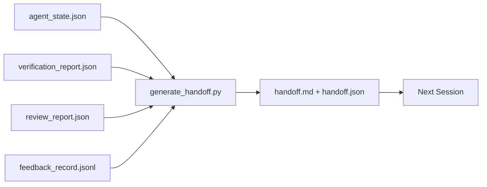

# 多会话交接

> 会话即将结束，但工作还没有完成。交接数据包是将"智能体工作了一个小时"转变为"下一个会话从第一分钟开始就能高效工作"的制品。要刻意构建它，而不是事后才想起来。

**类型：** Build
**语言：** Python (stdlib)
**前置要求：** Phase 14 · 34（仓库记忆）、Phase 14 · 38（验证）、Phase 14 · 39（审查）
**时间：** ~50 分钟

## 学习目标

- 识别每个交接数据包所需的七个字段。
- 从工作台制品自动生成交接数据，无需手写文本。
- 将大型反馈日志修剪为适合交接大小的摘要。
- 让下一个会话的第一个操作变得确定。

## 问题所在

会话结束了。智能体说"太好了，我们取得了进展"。下一个会话开始了。下一个智能体问"我们上次停在哪里了？"上一个智能体的回答已经丢失了。下一个智能体重新发现、重新运行相同的命令、重新向人类问相同的问题，花费三十分钟来恢复上一个会话的最后三十秒。

一次糟糕交接的代价会在任务的整个生命周期中，每次会话都付出。修复方法是在会话结束时自动生成一个数据包：改变了什么、为什么改变、尝试了什么、失败了什么、还剩什么、下次首先做什么。

## 概念



### 每个交接数据包包含的七个字段

| 字段 | 回答的问题 |
|------|-----------|
| `summary` | 一段话描述完成了什么 |
| `changed_files` | 一目了然的差异 |
| `commands_run` | 实际执行了什么 |
| `failed_attempts` | 尝试了什么以及为什么没有成功 |
| `open_risks` | 下次会话可能遇到什么问题，以及严重程度 |
| `next_action` | 下次会话的第一个具体步骤 |
| `verdict_pointer` | 指向验证报告和审查报告的路径 |

`next_action` 字段是承载关键作用的字段。一个包含所有字段但缺少 `next_action` 的交接是状态报告，而不是交接。

### 交接是生成的，而不是手写的

手写的交接在困难的日子里会被跳过。生成器读取工作台制品并输出数据包。智能体的工作是让工作台处于生成器可以总结的状态，而不是自己去写总结。

### 两种形式：人类可读和机器可读

`handoff.md` 是给人类读的。`handoff.json` 是给下一个智能体加载的。两者来自相同的源制品。如果它们不一致，以 JSON 为准。

### 反馈日志修剪

完整的 `feedback_record.jsonl` 可能有数百条记录。交接数据包只携带最后 K 条以及每条非零退出的记录。如果需要，下一个会话可以加载完整日志，但数据包保持较小的体积。

### 保持干净的状态

交接描述的是工作。干净的状态使工作可以恢复。它们不是同一回事。一个完美的 `handoff.md` 如果下一个会话打开时面对的是半应用的差异、智能体忘记的临时文件、游离的分支以及甚至还没运行就报错的测试，那它就毫无价值。下一个智能体然后花费前十分钟来清理上一个智能体的遗留，而不是开始构建，而这个代价会在任务的整个生命周期中每次会话复合增长。

因此，会话不是在功能可以工作时结束的。它是在工作台处于生成器可以总结且下一个会话可以信任的状态时结束的。清理是独立的阶段，在交接之前运行，而且它是一个检查项，不是习惯，因为习惯是在困难的日子里会被跳过的东西。

| 检查项 | 干净的含义 | 脏状态阻碍的原因 |
|--------|-----------|-----------------|
| 工作树 | 每个变更都已提交或明确暂存并附带说明 | 半应用的差异会被下一个智能体视为有意为之的工作 |
| 临时制品 | 没有 `*.tmp`、暂存目录、调试打印或注释掉的代码块残留 | 游离文件会污染差异和下一个智能体的心智模型 |
| 测试 | 通过，或者失败但失败原因已记录在 `open_risks` 中 | 无声的失败测试是一个陷阱，下一个会话会踩进去 |
| 功能看板 | `feature_list.json` 状态反映现实（Phase 14 · 36） | 过时的看板会引导下一个会话去做已经完成的工作 |
| 分支 | 在预期分支上，没有游离的 HEAD，没有孤立分支 | 错误的分支意味着下一个会话的第一次提交会落到错误的位置 |

清理阶段输出一个 `clean_state.json` 包含阻塞问题；空列表是交接生成器在写入数据包之前断言的前提条件。在脏树上构建的交接不是交接，而是转发的混乱。这两个制品配对使用：清理证明工作台可以安全离开，交接证明下一个会话知道从哪里开始。

## 构建它

`code/main.py` 实现了：

- 一个加载器，将状态、验证结果、审查和反馈收集到单个 `WorkbenchSnapshot` 中。
- 一个 `generate_handoff(snapshot) -> (markdown, payload)` 函数。
- 一个过滤器，选择最后 K 条反馈记录以及所有非零退出的记录。
- 一个演示运行，在脚本旁边写入 `handoff.md` 和 `handoff.json`。

运行：

```
python3 code/main.py
```

输出：打印的交接正文，以及磁盘上的两个文件。

## 生产环境中的模式

Codex CLI、Claude Code 和 OpenCode 各自提供了不同的压缩方案；结构化的交接数据包建立在它们之上。

**压缩策略各异，但数据包模式不变。** Codex CLI 的 POST /v1/responses/compact 是服务端的不透明 AES 块（针对 OpenAI 模型的快速路径）；回退方案是本地"交接摘要"，作为 `_summary` 用户角色消息附加。Claude Code 在上下文达到 95% 时运行五阶段渐进式压缩。OpenCode 使用基于时间戳的消息隐藏加上 5 个标题的 LLM 摘要。三种不同的机制，相同的需求：将压缩后仍保留的内容序列化为一个可移植的制品。数据包就是这个制品。

**新会话交接不是压缩。** 压缩延长会话；交接是干净地结束一个会话并启动下一个。Hermes Issue #20372 的描述（2026 年 4 月）是正确的：当就地压缩开始退化时，智能体应该写一个紧凑的交接，结束会话，然后在新的上下文中恢复。数据包使得这种转换变得廉价。错误的做法是一直压缩直到质量崩溃；正确的做法是为早期、干净的交接预留空间。

**每个分支和主题只有一个活跃交接。** 多智能体协调在过时交接上崩溃的情况比在糟糕的模型输出上更严重。始终包含 `branch`、`last_known_good_commit` 以及 `status` 字段，值为 `active | superseded | archived`。过时的交接被归档；只有活跃的那个驱动下一个会话。这就是交接作为笔记和交接作为状态之间的区别。

**在 50-75% 上下文之前收尾，而不是等到用尽。** 手写模式手册（CLAUDE.md + HANDOVER.md）报告说，当会话在 50-75% 上下文预算时结束（而不是 95%），效果最好。数据包生成器在压缩制品污染源状态之前干净地运行。在上下文完整时写入很廉价；当模型已经失去上下文时就很昂贵了。

## 使用它

生产环境模式：

- **会话结束钩子。** 当用户关闭聊天时，运行时触发生成器。数据包存入 `outputs/handoff/<session_id>/`。
- **PR 模板。** 生成器的 markdown 也是 PR 正文。审查者无需打开五个其他文件就能阅读。
- **跨智能体交接。** 用一个产品（Claude Code）构建，用另一个（Codex）继续。数据包是通用语言。

数据包体积小、格式统一、生产成本低廉。节省的成本会随着每次会话复合增长。

## 交付它

`outputs/skill-handoff-generator.md` 生成一个针对项目制品路径调优的生成器、一个在会话结束时运行它的钩子，以及一个下一个智能体在启动时读取的 `handoff.json` 模式。

## 练习

1. 添加一个 `assumptions_to_validate` 字段，展示构建者记录但审查者未评分超过 1 的每个假设。
2. 对失败运行和通过运行使用不同的反馈摘要修剪方式。为这种不对称性辩护。
3. 包含一个"给人类的问题"列表。一个问题进入数据包与进入聊天消息的阈值是什么？
4. 使生成器幂等：运行两次产生相同的数据包。需要什么保持稳定才能满足这一点？
5. 添加一个"下次会话前置条件"部分，列出下一个会话在行动之前必须加载的制品。

## 关键术语

| 术语 | 人们怎么说 | 实际含义 |
|------|-----------|---------|
| 交接数据包 | "会话摘要" | 携带七个字段的生成制品，包括 markdown 和 JSON |
| 下一个操作 | "首先做什么" | 启动下一个会话的那个具体步骤 |
| 反馈修剪 | "日志摘要" | 最后 K 条记录加上每条非零退出 |
| 状态报告 | "我们做了什么" | 缺少 `next_action` 的文档；有用，但不是交接 |
| 验证指针 | "凭证" | 指向验证报告和审查报告的路径，用于可追溯性 |

## 延伸阅读

- [Anthropic, Effective harnesses for long-running agents](https://www.anthropic.com/engineering/effective-harnesses-for-long-running-agents)
- [OpenAI Agents SDK handoffs](https://platform.openai.com/docs/guides/agents-sdk/handoffs)
- [Codex Blog, Codex CLI Context Compaction: Architecture, Configuration, Managing Long Sessions](https://codex.danielvaughan.com/2026/03/31/codex-cli-context-compaction-architecture/) — POST /v1/responses/compact 和本地回退
- [Justin3go, Shedding Heavy Memories: Context Compaction in Codex, Claude Code, OpenCode](https://justin3go.com/en/posts/2026/04/09-context-compaction-in-codex-claude-code-and-opencode) — 三方压缩对比
- [JD Hodges, Claude Handoff Prompt: How to Keep Context Across Sessions (2026)](https://www.jdhodges.com/blog/ai-session-handoffs-keep-context-across-conversations/) — CLAUDE.md + HANDOVER.md，50-75% 上下文预算
- [Mervin Praison, Managing Handoffs in Multi-Agent Coding Sessions: Fresh Context Without Losing Continuity](https://mer.vin/2026/04/managing-handoffs-in-multi-agent-coding-sessions-fresh-context-without-losing-continuity/) — 分布式系统框架
- [Hermes Issue #20372 — automatic fresh-session handoff when compression becomes risky](https://github.com/NousResearch/hermes-agent/issues/20372)
- [Hermes Issue #499 — Context Compaction Quality Overhaul](https://github.com/NousResearch/hermes-agent/issues/499) — Codex CLI 中面向交接的提示
- [Microsoft Agent Framework, Compaction](https://learn.microsoft.com/en-us/agent-framework/agents/conversations/compaction)
- [OpenCode, Context Management and Compaction](https://deepwiki.com/sst/opencode/2.4-context-management-and-compaction)
- [LangChain, Context Engineering for Agents](https://www.langchain.com/blog/context-engineering-for-agents)
- Phase 14 · 34 — 生成器读取的状态文件
- Phase 14 · 38 — 数据包指向的验证结果
- Phase 14 · 39 — 打包到数据包中的审查报告
