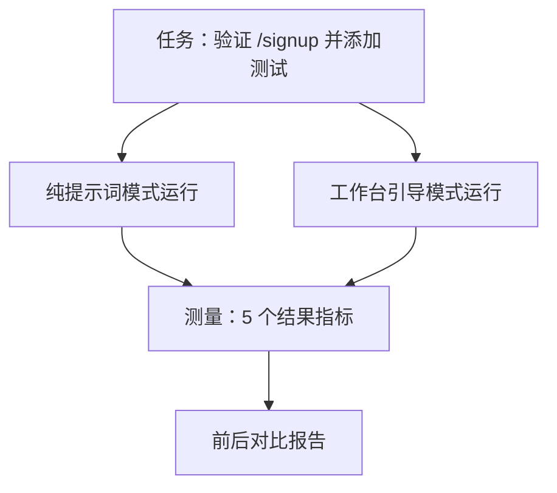

# 真实仓库上的工作台

> 十一节课的界面教学如果不能在真实代码库中存活下来就毫无价值。本课在一个小型示例应用上运行同一任务两次：纯提示词模式 vs 工作台引导模式。用数据说话。

**类型：** Build
**语言：** Python (stdlib)
**前置条件：** 第 14 阶段 · 第 32 到 40 节
**时间：** ~60 分钟

## 学习目标

- 将七个工作台界面整合到一个小应用中。
- 运行同一任务两次（纯提示词模式和工作台引导模式），测量五个结果。
- 阅读前后对比报告，判断哪些界面带来了最大杠杆效应。
- 回应"但我的模型已经足够好了"这种反驳。

## 问题

在一个玩具任务上演示无法说服任何人。工作台的价值在于：当一个感觉真实的任务在感觉真实的仓库上落地到生产环境时，失败更少、回滚更少，并且为下一次会话留下可复用的数据包。

本课提供这个感觉真实的仓库，并通过两个流程运行同一任务。结果就是一份可以交给质疑者的前后对比报告。

## 核心概念



### 示例应用

`sample_app/` 中的一个最小化 FastAPI 风格处理器：

- `app.py`，包含 `/signup`（尚无验证）。
- `test_app.py`，包含一个正常路径测试。
- `README.md` 和 `scripts/release.sh` 作为禁止操作的诱饵。

### 任务

> 为 `/signup` 添加输入验证：拒绝短于 8 个字符的密码，返回 422 及带类型的错误信封。添加一个测试证明新行为生效。

### 两个流程

纯提示词模式：

1. 阅读 README。
2. 阅读 `app.py`。
3. 编辑文件。
4. 声称完成。

工作台引导模式：

1. 运行初始化脚本（第 35 节）。
2. 阅读范围契约（第 36 节）。
3. 阅读状态（第 34 节）。
4. 仅编辑允许的文件。
5. 通过反馈运行器运行验收命令（第 37 节）。
6. 运行验证门禁（第 38 节）。
7. 运行审查器（第 39 节）。
8. 生成交接数据包（第 40 节）。

### 测量的五个结果指标

| 结果指标 | 重要性 |
|---------|--------|
| `tests_actually_run` | 大多数"测试通过"的说法无法验证 |
| `acceptance_met` | 证明目标的测试必须是实际运行的测试 |
| `files_outside_scope` | 范围蔓延是最主要的隐性失败 |
| `handoff_quality` | 下一次会话会因这份交接受益或受损 |
| `reviewer_total` | 在门禁之上的定性判断 |

## 构建过程

`code/main.py` 对相同的示例应用 fixtures 运行两个流程。两个流程都是脚本化的（循环中无 LLM 参与），因此测量可重复。脚本将对比结果写入 `before-after-report.md` 和 `comparison.json`。

运行方式：

```
python3 code/main.py
```

输出：控制台表格展示各流程的结果指标，markdown 报告保存在脚本旁边，JSON 文件供需要绘图的人使用。

## 生产环境中的真实模式

质疑者的问题是："工作台到底有多大帮助？" 2026 年的数据比任何解释都有说服力。

**Terminal Bench 从 Top-30 到 Top-5，同一个模型。** LangChain 的 *Anatomy of an Agent Harness*（2026 年 4 月）：一个编码智能体仅通过改变框架（harness）就从 Terminal Bench 2.0 的 30 名开外跃升到第 5 名。同一个模型，不同的界面，排名提升 25 位。

**Vercel 删除 80% 工具后成功率从 80% 提升到 100%。** Vercel 报告称删除智能体 80% 的工具后，成功率从 80% 提升到 100%。更小的工具界面、更聚焦的范围、更少的失败路径。留白制胜。

**Harvey 仅通过框架优化实现 2 倍准确率提升。** 法律智能体通过框架优化将准确率提升了一倍以上，未更改模型。

**88% 的企业级 AI 智能体项目未能到达生产环境。** preprints.org 的 *Harness Engineering for Language Agents* 论文（2026 年 3 月）将失败归因于运行时而非推理：过时的状态、脆弱的重试、过度膨胀的上下文、从中间错误中恢复能力差。

**长上下文坍塌。** WebAgent 基线在长上下文条件下从 40-50% 成功率下降到 10% 以下，主要原因是无限循环和目标丢失。Ralph Loop 和交接数据包正是为此而生。

**假阴性仍然存在。** 单步事实任务、一行 lint、格式化器运行、模型已经背下的一切——这些在纯提示词模式下运行更快。基准测试应该诚实地列举它们，以免工作台被定位为过度设计。

核心要点不是"框架永远胜出"。模型会逐渐吸收框架技巧。核心要点是：当前，工程负担集中在七个界面上，数据证明了这一点。

## 使用场景

本课是你在以下情况引用的案例文件：

- 有人问为什么每个 PR 都携带 `agent-rules.md` 和范围契约。
- 团队想"仅在这个冲刺中"跳过验证门禁。
- 新的智能体产品发布，你需要一个可移植的基准测试来判断它是否真正节省时间。

数据比解释走得更远。

## 交付物

`outputs/skill-workbench-benchmark.md` 是一个可移植的评估框架，可在任何智能体产品上对项目自己的示例应用运行两个流程，并报告五个结果指标。

## 练习

1. 添加第六个结果指标：首次有意义编辑的时间。你如何干净地测量它？
2. 在你的代码库中一个真实的第二天任务上运行对比。工作台数据在哪里表现不佳？
3. 添加一个"假阴性"通道：纯提示词模式更快的任务，以及工作台开销是真实成本的情况。论证为什么仍然保留工作台。
4. 将脚本化的"智能体"替换为真正的 LLM 调用。哪些结果指标变得更不稳定？
5. 为非工程师撰写一页摘要。什么内容能经受住精简？

## 关键术语

| 术语 | 俗称 | 实际含义 |
|------|------|---------|
| 示例应用 | "玩具仓库" | 足够小但足够真实，可以运行全部七个界面 |
| 流程 | "工作流" | 智能体遵循的有序界面读写序列 |
| 前后对比报告 | "证据" | 交给质疑者的那份成果 |
| 假阴性 | "工作台过度设计" | 纯提示词模式更快的任务；值得诚实地列举 |
| 工作台基准测试 | "可靠性评分" | 可在你的代码库上运行对比的可移植框架 |

## 延伸阅读

- [LangChain, The Anatomy of an Agent Harness](https://blog.langchain.com/the-anatomy-of-an-agent-harness/) — Terminal Bench 从 Top-30 到 Top-5 的数据
- [MongoDB, The Agent Harness: Why the LLM Is the Smallest Part of Your Agent System](https://www.mongodb.com/company/blog/technical/agent-harness-why-llm-is-smallest-part-of-your-agent-system) — Vercel 和 Harvey 的数据
- [preprints.org, Harness Engineering for Language Agents](https://www.preprints.org/manuscript/202603.1756) — 88% 企业失败率，运行时根因
- [HN: Improving 15 LLMs at Coding in One Afternoon. Only the Harness Changed](https://news.ycombinator.com/item?id=46988596) — 在 15 个模型上复现
- [Cloudflare, Orchestrating AI Code Review at Scale](https://blog.cloudflare.com/ai-code-review/) — 生产环境中 30 天 13.1 万次代码审查
- [Anthropic, Building Effective Agents](https://www.anthropic.com/research/building-effective-agents)
- 第 14 阶段 · 第 32 到 40 节 — 本课端到端运行的七个界面
- 第 14 阶段 · 第 19 节 — SWE-bench、GAIA、AgentBench 作为本课补充的宏观基准测试
- 第 14 阶段 · 第 30 节 — eval 驱动的智能体开发，同一个框架接入
