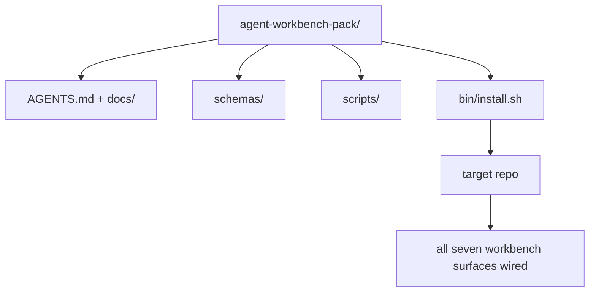

# 毕业设计：交付一个可复用的 Agent 工作台包

> 小轨课程以一个可放入任意仓库的包作为收尾。十一个课程的界面被压缩成一个目录，你只需 `cp -r` 就能让一个 Agent 在第二天早上稳定工作。毕业设计是本课程的核心产出。

**类型：** Build
**语言：** Python（标准库）
**前置条件：** 第 14 阶段 · 31 至 14 · 41
**时间：** 约 75 分钟

## 学习目标

- 将七个工作台界面打包为一个即插即用的目录。
- 固定 schema、脚本和模板，使新仓库获得一个已知可用的基线。
- 添加一个安装脚本，以幂等方式部署该包。
- 决定哪些内容留在包内、哪些留在包外，并为每个决定提供理由。

## 问题

一个工作台如果分散在 Google 文档、聊天记录和三个半记半忘的脚本中，那它每个季度都会被重新构建一次。解决方案是一个版本化的包：一个包含界面、schema、脚本和一键安装器的仓库或目录。

完成本课程后，你将在磁盘上拥有 `outputs/agent-workbench-pack/`，以及一个能将其部署到任意目标仓库的 `bin/install.sh`。

## 概念



### 包的目录结构

```
outputs/agent-workbench-pack/
├── AGENTS.md
├── docs/
│   ├── agent-rules.md
│   ├── reliability-policy.md
│   ├── handoff-protocol.md
│   └── reviewer-rubric.md
├── schemas/
│   ├── agent_state.schema.json
│   ├── task_board.schema.json
│   └── scope_contract.schema.json
├── scripts/
│   ├── init_agent.py
│   ├── run_with_feedback.py
│   ├── verify_agent.py
│   └── generate_handoff.py
├── bin/
│   └── install.sh
└── README.md
```

### 哪些保留，哪些排除

保留：

- 界面 schema。它们是契约。
- 上面的四个脚本。它们是运行时。
- 四份文档。它们是规则和评分标准。

排除：

- 项目特定的任务。任务属于目标仓库的看板，而非包本身。
- 厂商 SDK 调用。该包与框架无关。
- 入职文档。该包放在团队现有入职文档旁边，而非嵌入其中。

### 安装器

一个简短的 `bin/install.sh`（或 `bin/install.py`）：

1. 除非使用 `--force`，否则拒绝覆盖已有包。
2. 将包复制到目标仓库。
3. 如果存在 `.github/workflows/`，则配置 CI。
4. 打印后续步骤：填写看板、设置验收命令、运行初始化脚本。

### 版本管理

该包包含一个 `VERSION` 文件。需要迁移的 schema 升级和脚本变更提升主版本号。仅文档变更提升补丁版本号。目标仓库的 `agent_state.json` 记录其初始化时所使用的包版本。

## 动手构建

`code/main.py` 将包组装到课程目录旁的 `outputs/agent-workbench-pack/` 中，内容来源于本小轨之前课程的 schema 和脚本，以及你已编写的文档。

运行：

```
python3 code/main.py
```

该脚本复制并固定界面、编写 README、打印包目录树，然后以退出码 0 退出。重复运行是幂等的。

## 真实世界中的生产模式

一个包只有在经历分叉、更新和不友好的上游时仍然存活才有价值。以下四个模式可以实现这一点。

**`VERSION` 是契约，不是营销。** 主版本号提升需要状态迁移。次版本号提升需要检查器重新运行。补丁版本号仅涉及文档变更。安装器在每次安装时将 `.workbench-version` 写入目标仓库；`lint_pack.py` 在目标锁定版本与包的 `VERSION` 不一致时拒绝发布。这就是 `npm`、`Cargo` 和 `pyproject.toml` 在十年剧变中存活的方式；Agent 并不会改变这些规则。

**跨工具分发的单一来源。** Nx 通过一个 `nx ai-setup` 命令从单一配置部署 `AGENTS.md`、`CLAUDE.md`、`.cursor/rules/`、`.github/copilot-instructions.md` 和一个 MCP 服务器。该包应做同样的事；安装器生成符号链接（`ln -s AGENTS.md CLAUDE.md`），使单一事实来源分发到每个编程 Agent。为支持某个工具而分叉该包是一种失败模式。

**拒绝处理非平凡状态的 `uninstall.sh`。** 卸载该包不得删除用户的 `agent_state.json`、`task_board.json` 或 `outputs/`。卸载器移除 schema、脚本、文档和 `AGENTS.md`（可通过 `--keep-agents-md` 选择保留），并在状态文件有任何未提交变更时拒绝继续。状态属于用户；包不拥有它。

**可发布的 Skill。SkillKit 式分发。** 该包以 SkillKit skill 的形式发布：`skillkit install agent-workbench-pack` 从单一来源部署到 32 个 AI Agent。包仓库是事实来源；SkillKit 是分发渠道。厂商锁定被消除；七个界面保持不变。

## 使用方式

该包有三种发布方式：

- **作为目录放入仓库。** `cp -r outputs/agent-workbench-pack /path/to/repo`。
- **作为公开模板仓库。** 分叉并自定义，用 `VERSION` 控制漂移。
- **作为 SkillKit skill。** 接入你的 Agent 产品，使一条命令即可部署。

该包是配方。每次安装是一道菜。

## 交付

`outputs/skill-workbench-pack.md` 生成一个项目定制的包：规则根据团队历史进行精简，范围 glob 与仓库匹配，评分标准维度增加一个领域特定条目。

## 练习

1. 决定哪个可选的第五份文档值得纳入规范包。为你的决定提供理由。
2. 将安装器重写为带 `--dry-run` 标志的 Python 版本。与 bash 版本比较易用性。
3. 添加一个 `bin/uninstall.sh`，安全移除包，并在状态文件有非平凡历史时拒绝。什么算非平凡？
4. 添加一个 `lint_pack.py`，在包与 `VERSION` 漂移时失败。将其接入包自身仓库的 CI。
5. 编写从手工工作台迁移到该包的运维手册。什么操作顺序能使停机时间最小？

## 关键术语

| 术语 | 俗称 | 实际含义 |
|------|------|----------|
| 工作台包 | "入门套件" | 一个包含所有七个界面的版本化目录 |
| 安装器 | "安装脚本" | `bin/install.sh`，以幂等方式部署包 |
| 包版本 | "VERSION" | schema/脚本变更提升主版本号，仅文档变更提升补丁版本号 |
| 即插即用包 | "cp -r 就能用" | 包在第一天无需仓库定制即可工作 |
| 可分叉模板 | "GitHub 模板" | 可通过 GitHub 的 "Use this template" 克隆的公开仓库 |

## 延伸阅读

- 第 14 阶段 · 31 至 14 · 41 — 该包捆绑的每个界面
- [SkillKit](https://github.com/rohitg00/skillkit) — 将此 skill 安装到 32 个 AI Agent
- [Nx 博客，教你的 AI Agent 如何在 Monorepo 中工作](https://nx.dev/blog/nx-ai-agent-skills) — 跨六个工具的单一来源生成器
- [agents.md — 开放规范](https://agents.md/) — 你的包路由必须实现的内容
- [HKUDS/OpenHarness](https://github.com/HKUDS/OpenHarness) — 包等效物的参考实现
- [andrewgarst/agentic_harness](https://github.com/andrewgarst/agentic_harness) — 带评估套件的 Redis 支持参考
- [Augment Code，好的 AGENTS.md 是一次模型升级](https://www.augmentcode.com/blog/how-to-write-good-agents-dot-md-files) — 包文档质量标准
- [Anthropic，长时间运行 Agent 的有效工具](https://www.anthropic.com/engineering/effective-harnesses-for-long-running-agents)
- [Anthropic，长时间运行应用开发的工具设计](https://www.anthropic.com/engineering/harness-design-long-running-apps)
- 第 14 阶段 · 30 — 评估驱动的 Agent 开发，消费该包的验证门控
- 第 14 阶段 · 41 — 该包改进的前后基准测试
