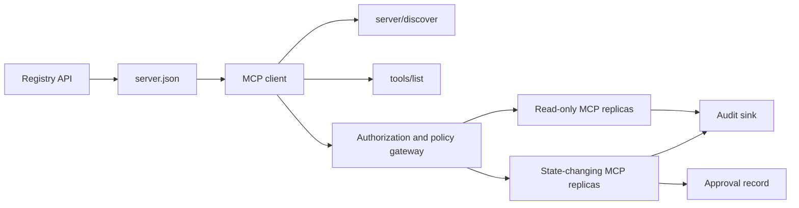

# Capstone 13: Stateless MCP Server with Registry and Governance

> Production MCP is not one server process. It is a chain of contracts: publishable metadata, live discovery, a stateless request envelope, authorization, policy, audit, and deployment evidence.

**Type:** Capstone
**Languages:** Python and TypeScript reference models; any production language
**Prerequisites:** Phase 11, Phase 13, Phase 14, Phase 17, and Phase 18
**Required MCP deep dives:** [Lesson 28: Tool Contracts](../../../13-tools-and-protocols/28-mcp-tool-contracts-and-content/docs/en.md), [Lesson 29: Reliability](../../../13-tools-and-protocols/29-mcp-reliability-cancellation-and-flow-control/docs/en.md), [Lesson 30: Registry Supply Chain](../../../13-tools-and-protocols/30-mcp-registry-supply-chain-and-drift/docs/en.md), and [Lesson 31: Conformance Operations](../../../13-tools-and-protocols/31-mcp-conformance-versioning-and-operations/docs/en.md)
**Protocol target:** MCP `2026-07-28`
**Time:** ~25 hours

## Learning Objectives

- Implement the stateless MCP request and result envelope.
- Keep Registry metadata separate from live protocol discovery.
- Build deterministic, cache-aware tool discovery.
- Enforce issuer, audience, scope, and approval policy for every tool call.
- Deploy Streamable HTTP without session affinity.
- Prove behavior at the wire, authorization, policy, registry, and audit boundaries.

## Required MCP Prerequisite Path

Complete the four linked Phase 13 lessons in order before treating this capstone as production-ready:

1. [Lesson 28](../../../13-tools-and-protocols/28-mcp-tool-contracts-and-content/docs/en.md) defines the tool, schema, content, pagination, completion, routing, and error contracts this server must expose.
2. [Lesson 29](../../../13-tools-and-protocols/29-mcp-reliability-cancellation-and-flow-control/docs/en.md) defines cancellation races, deadlines, idempotency, backpressure, retry, and reconnect behavior.
3. [Lesson 30](../../../13-tools-and-protocols/30-mcp-registry-supply-chain-and-drift/docs/en.md) defines namespace, provenance, admission pin, Registry status, drift, ledger, and rollback evidence.
4. [Lesson 31](../../../13-tools-and-protocols/31-mcp-conformance-versioning-and-operations/docs/en.md) defines golden and negative transcripts, strict version eras, SDK differential checks, proxy proof, redaction, health, and release gating.

The capstone integrates those artifacts. It does not replace them with one happy-path SDK test.

## The Problem

An internal platform needs read-only data tools and a small set of state-changing tools. Developers must be able to discover the server, understand how to connect, inspect its live capabilities, and call only the operations they are authorized to use.

The difficult part is not registering a function. The difficult part is keeping six different truths aligned:

1. `server.json` says where the server can be installed or reached.
2. `server/discover` says what the live process supports now.
3. Every request says which protocol revision and client capabilities it uses.
4. Authorization binds a caller to the correct issuer, resource, and scopes.
5. Policy decides whether this specific action may run.
6. Audit evidence records what crossed the boundary without leaking secrets or sensitive payloads.

If any one of these drifts, the platform may list a server that cannot be reached, route an incompatible client, accept a token minted for another resource, or expose a destructive action without the expected review.

## The Two Discovery Layers

The Registry and the live MCP server answer different questions.

| Layer | Contract | Question it answers |
|---|---|---|
| Publication | `server.json` and Registry API | What is this server, where is its package or remote endpoint, and how is it configured? |
| Runtime | `server/discover` | Which protocol versions, capabilities, extensions, and server identity does this process support? |

The official Registry uses a versioned `server.json` schema. A remote entry can name a Streamable HTTP URL:

```json
{
  "$schema": "https://static.modelcontextprotocol.io/schemas/2025-12-11/server.schema.json",
  "name": "com.example/internal-readonly",
  "title": "Internal Read-Only Tools",
  "description": "Read-only incident and data lookup tools.",
  "version": "1.0.0",
  "remotes": [
    {
      "type": "streamable-http",
      "url": "https://mcp.internal.example.com/readonly"
    }
  ]
}
```

The Registry schema version and the MCP protocol revision are independent. Do not rewrite one date to match the other. Validate each document against its own contract.

Schema validity does not prove namespace ownership. A publisher verified for `example.com` uses the reverse-DNS namespace `com.example/*` or one of its child namespaces. The Registry authentication flow proves that ownership. Keeping the domain labels in their ordinary order names a different namespace.

The stdlib model's `validate_registry_document` function is intentionally a partial remote-profile validator. It checks the official required `name`, `description`, and `version` fields; the optional `title`; the published name and length constraints; concrete-version shape; and each `streamable-http` or `sse` remote's HTTP(S) URL shape. It additionally requires a non-empty `remotes` list because this capstone always live-probes a remote. `validate_publisher_namespace` separately checks the name against the verified publisher domain, while `validate_runtime_alignment` compares the publication name and version with live `serverInfo`. The official schema also supports package-only records and more remote fields. Before publication, validate the entire document with the pinned official JSON Schema or `mcp-publisher`; do not present this dependency-free subset as full schema validation.

The server must implement `server/discover`; a client may call it before other methods. This capstone client does so after resolving the endpoint, and receives the current protocol revision and live capabilities:

```json
{
  "resultType": "complete",
  "supportedVersions": ["2026-07-28"],
  "capabilities": {
    "tools": {
      "listChanged": false
    }
  },
  "_meta": {
    "io.modelcontextprotocol/serverInfo": {
      "name": "com.example/internal-readonly",
      "version": "1.0.0"
    }
  },
  "ttlMs": 3600000,
  "cacheScope": "public"
}
```

A private catalog may index extra ownership, review, or lifecycle data, but it must not invent that data as MCP wire fields or root `server.json` fields. Store organizational policy beside the published record. When public custom metadata is necessary, use the Registry's `_meta.io.modelcontextprotocol.registry/publisher-provided` extension and stay within its 4 KB limit.

## Stateless MCP Core

MCP revision `2026-07-28` removes protocol sessions and the `initialize` / `notifications/initialized` handshake. It also removes `Mcp-Session-Id`.

Every request carries protocol context in `params._meta`:

```json
{
  "io.modelcontextprotocol/protocolVersion": "2026-07-28",
  "io.modelcontextprotocol/clientCapabilities": {},
  "io.modelcontextprotocol/clientInfo": {
    "name": "internal-platform-client",
    "version": "1.0.0"
  }
}
```

The version and capabilities are request facts, not connection facts. A load balancer may send consecutive requests to different healthy replicas because either replica can validate the request from the message itself.

Ordinary results include `resultType: "complete"`. Servers should place their identity in `_meta.io.modelcontextprotocol/serverInfo` on each result. A missing or non-string protocol version is invalid params `-32602`. Error `-32022` is only for a supplied string that is unsupported, with exactly `{"supported": ["2026-07-28"], "requested": "..."}` as its data.

### Cacheable discovery

`tools/list` must be deterministic for the same effective tool set. The result includes:

- `ttlMs`, a freshness hint for the client;
- `cacheScope`, either `public` or `private`;
- a stable tool order so identical lists can reuse prompt caches;
- `resultType: "complete"` and server identity metadata.

Per-user authorization should normally produce `cacheScope: "private"`. Do not put user-specific tool visibility behind a shared public cache.

## Streamable HTTP

A network server exposes one MCP endpoint that accepts POST. Each JSON-RPC request or notification gets its own POST.

For a request, the server returns either one JSON object or an SSE stream scoped to that request. A long-lived `subscriptions/listen` request carries opted-in change notifications. There is no standalone GET stream, session DELETE, session header, or `Last-Event-ID` replay in the current transport.

Each request includes:

- `MCP-Protocol-Version`, matching the body metadata;
- `Mcp-Method`, matching the JSON-RPC method;
- `Mcp-Name` for `tools/call`, `resources/read`, and `prompts/get`;
- `Accept: application/json, text/event-stream`.

Reject mismatched mirrored headers with the specified `-32020` error. Validate `Origin`, bind local development servers to loopback, authenticate remote clients, and treat a closed request-scoped SSE response as cancellation.



```figure
cf-mcp-gate
```

## Authorization and Policy

Transport metadata is not authorization. Validate authorization on every call.

For remote servers:

1. Discover protected-resource metadata.
2. Select the authorization server for that resource.
3. Prefer Client ID Metadata Documents for client registration. Treat Dynamic Client Registration as compatibility support.
4. Send the resource indicator during authorization.
5. Validate a returned `iss` value against the authorization server recorded for the flow.
6. Key client credentials by issuer. Never reuse registration data across issuers.
7. Validate token issuer, audience or resource, expiry, and scopes at the MCP server.
8. Apply a second policy decision to the concrete tool and arguments.

Tool annotations such as `readOnlyHint` and `destructiveHint` help clients present risk. They are not trusted authorization controls.

### Approval is a record, not a magic scope

A state-changing call needs an approval record bound to the actor, tool, normalized arguments or digest, target environment, expiry, and one-time or repeat-use policy. A chat message alone is not proof of approval.

The Python model hashes canonical JSON with sorted keys, then binds that digest with the token subject, tool name, server URL, and expiry. Replaying the record after changing even one argument fails before the handler runs. Approval is separate evidence, not a scope added to the access token.

Keep high-risk tools on a separately reviewable surface when that materially reduces blast radius. Separation is useful only if credentials, policy, deployment identity, and audit controls are also separate.

## Build It

### 1. Model publication metadata

Create and schema-validate `server.json`. Include a stable name inside the namespace authenticated for the publisher, plus version, description, official `repository` or `packages` metadata when applicable, and a remote or stdio transport. Keep secrets as declared environment-variable inputs, never literal values.

### 2. Implement live discovery

Implement `server/discover` before any feature RPC. Advertise supported protocol versions, capabilities, extensions, and server identity. Add a version rejection case using `-32022`.

### 3. Implement the stateless envelope

Require protocol version and client capabilities in every request. Return `resultType` and server identity in every result. Remove initialization state, connection-scoped capability caches, and session identifiers.

### 4. Build the tool surface

Start with two read-only tools and one state-changing tool. Give each a bounded JSON Schema, precise description, deterministic result shape, and honest annotations. Add output schemas when clients rely on structured results.

### 5. Add cache-aware listing

Return tools in stable order with `ttlMs` and `cacheScope`. Exercise cache expiry and list-change notification behavior separately.

### 6. Add authorization and policy

Validate issuer, audience, expiry, and scope. Run a policy decision for every tool call. Bind approvals to exact high-risk actions. Deny missing or stale approvals before executing a handler.

### 7. Separate registry and runtime validation

Validate the static `server.json` record, then probe the remote endpoint with `server/discover`. Report drift when the published remote, identity, version, or required capabilities disagree with the live process.

### 8. Add audit evidence

Record actor, issuer, resource, tool, policy decision, request identifier, trace context, latency, and outcome. Redact or digest sensitive arguments and results before persistence. Keep the audit sink outside model-visible context.

### 9. Exercise horizontal scaling

Place two stateless replicas behind a load balancer. Send at least 100 concurrent requests. Demonstrate that correctness does not depend on affinity. If a tool needs cross-call state, mint an explicit opaque handle and store it in a shared durable system.

### 10. Cross the real wire

Run conformance checks against the actual server binary. Capture request headers and JSON bodies, not only SDK objects. Exercise wrong version, header mismatch, missing scope, wrong audience, malformed arguments, handler failure, cancellation, and cache expiry.

## Required Evidence Pack

A submission is incomplete until it contains all five evidence classes:

| Evidence | Minimum proof | Source lesson |
|---|---|---|
| Wire | Redacted raw headers and JSON-RPC bodies for golden and negative cases, including metadata type failure, header mismatch, unsupported version, missing or unknown `resultType`, notification no-response, and response ID matching | [Lesson 31](../../../13-tools-and-protocols/31-mcp-conformance-versioning-and-operations/docs/en.md) |
| Proxy | The same stable case run directly and through the deployed intermediary, with ingress, origin, and egress status and body digests; prove protocol errors are not collapsed into generic 500 responses and streaming is not buffered | [Lessons 29](../../../13-tools-and-protocols/29-mcp-reliability-cancellation-and-flow-control/docs/en.md) and [31](../../../13-tools-and-protocols/31-mcp-conformance-versioning-and-operations/docs/en.md) |
| Admission | Verified publisher namespace, immutable Registry record digest, artifact or remote provenance, live `server/discover` identity and capability observation, descriptor pin, current Registry status, and admission-ledger event | [Lesson 30](../../../13-tools-and-protocols/30-mcp-registry-supply-chain-and-drift/docs/en.md) |
| Retry | A cancellation-versus-completion race, explicit timeout, safe read retry, mutation idempotency key, reconnect refetch, and proof that request cancellation cannot silently become durable task cancellation | [Lesson 29](../../../13-tools-and-protocols/29-mcp-reliability-cancellation-and-flow-control/docs/en.md) |
| Rollback | Exact previous version, admission and artifact digests, descriptor pin, active Registry status, current health window, route restoration result, and redacted decision evidence | [Lessons 30](../../../13-tools-and-protocols/30-mcp-registry-supply-chain-and-drift/docs/en.md) and [31](../../../13-tools-and-protocols/31-mcp-conformance-versioning-and-operations/docs/en.md) |

Store a digest of the redacted pack with the release. If any class is missing, hold the release. Do not infer proxy behavior from an in-process dispatcher, admission from Registry presence, retry safety from a new JSON-RPC id, or rollback readiness from “the previous deployment.”

## Local Reference Models

The Python model demonstrates registry metadata, reverse-DNS publisher namespace validation, publication-to-runtime identity checks, live discovery, deterministic tool listing, per-request metadata, trusted-issuer, audience, expiry, and scope checks, action-bound approvals, a documented partial Registry validator, policy, and audit without opening a network socket:

```bash
cd phases/19-capstone-projects/13-mcp-server-with-registry
python3 code/main.py
python3 -m unittest discover -s code/tests -v
```

The TypeScript project exposes the stateless JSON-RPC shape over stdio without an MCP SDK. Its `tools/call` path enforces the same bounded input schemas advertised by `tools/list`; invalid arguments for a known tool return a complete result with `isError: true` without invoking the executor:

```bash
cd phases/19-capstone-projects/13-mcp-server-with-registry/code/ts
npm install
npm run typecheck
npm test
npm run demo
```

These models prove local contract logic. They do not prove HTTP headers, OAuth exchange, Registry publication, OPA integration, load balancing, or collector receipt.

## Wire Example

```http
POST /mcp HTTP/1.1
Host: mcp.internal.example.com
Content-Type: application/json
Accept: application/json, text/event-stream
MCP-Protocol-Version: 2026-07-28
Mcp-Method: tools/call
Mcp-Name: postgres.readonly
Authorization: Bearer REDACTED

{
  "jsonrpc": "2.0",
  "id": 42,
  "method": "tools/call",
  "params": {
    "name": "postgres.readonly",
    "arguments": {"sql": "SELECT 1"},
    "_meta": {
      "io.modelcontextprotocol/protocolVersion": "2026-07-28",
      "io.modelcontextprotocol/clientCapabilities": {},
      "io.modelcontextprotocol/clientInfo": {
        "name": "internal-platform-client",
        "version": "1.0.0"
      }
    }
  }
}
```

## Ship It

Ship a repository containing:

- a schema-valid `server.json`;
- read-only and state-changing server surfaces;
- `server/discover`, deterministic `tools/list`, and policy-gated `tools/call`;
- a Streamable HTTP deployment with two interchangeable replicas;
- authorization and approval integration;
- a Registry publisher or private Registry API adapter;
- policy definitions and action-bound approval records;
- redacted audit output and trace propagation;
- wire and proxy failure evidence;
- admission, retry, health, and rollback evidence with a digest of the redacted pack.

| Weight | Criterion | Evidence |
|---:|---|---|
| 25 | Protocol correctness | Stateless request metadata, discovery, results, headers, and negative cases |
| 20 | Authorization | Issuer, audience, expiry, scope, and action-bound approval cases |
| 15 | Registry integrity | Valid `server.json`, publication record, live discovery probe, and drift report |
| 15 | Policy and safety | Allow, deny, malformed, stale approval, and sensitive-data cases |
| 15 | Scale and reliability | Two replicas, no affinity dependency, cancellation, timeout, and recovery |
| 10 | Auditability | Redacted receiver-side audit and trace evidence |

## Exercises

1. Change the published remote URL while leaving the live server unchanged. Make the registry validation report the exact drift.
2. Send `tools/list` twice with identical inputs and prove byte-stable tool order. Then expire `ttlMs` and refresh.
3. Send a valid body with a different `MCP-Protocol-Version` header. Return `-32020` and do not invoke policy or the tool.
4. Mint a token for the read-only server and present it to the state-changing server. Prove audience validation fails before the handler runs.
5. Bind an approval to one normalized argument digest. Change one field and prove the approval cannot be replayed.
6. Route consecutive calls to alternating replicas. Replace hidden process memory with an explicit shared handle wherever the workflow needs persistence.
7. Break a request-scoped SSE connection and retry with a new JSON-RPC request ID. Verify that no `Last-Event-ID` recovery path is used.

## Key Terms

| Term | What people say | What it actually means |
|---|---|---|
| Stateless MCP | "No state anywhere" | No protocol session; cross-call state is explicit and server-managed |
| `server.json` | "The tool manifest" | Registry metadata for naming, packaging, configuration, and transports |
| `server/discover` | "The handshake" | A normal mandatory RPC for live versions and capabilities, not a session initializer |
| Cache scope | "Can I cache it?" | Whether a cacheable result is safe for shared or private reuse |
| Policy decision | "The token allows it" | A separate decision over actor, tool, target, arguments, and context |
| Approval record | "A human clicked yes" | Evidence bound to one actor and consequential action under an expiry policy |
| Explicit handle | "A session ID" | Ordinary application data for named server-managed state, not protocol connection state |

## Further Reading

- [MCP 2026-07-28 key changes](https://modelcontextprotocol.io/specification/2026-07-28/changelog)
- [Streamable HTTP](https://modelcontextprotocol.io/specification/2026-07-28/basic/transports/streamable-http)
- [Server discovery](https://modelcontextprotocol.io/specification/2026-07-28/server/discover)
- [MCP authorization](https://modelcontextprotocol.io/specification/2026-07-28/basic/authorization)
- [Official Registry server.json requirements](https://github.com/modelcontextprotocol/registry/blob/main/docs/reference/server-json/official-registry-requirements.md)
- [Official Registry OpenAPI contract](https://registry.modelcontextprotocol.io/openapi.yaml)
