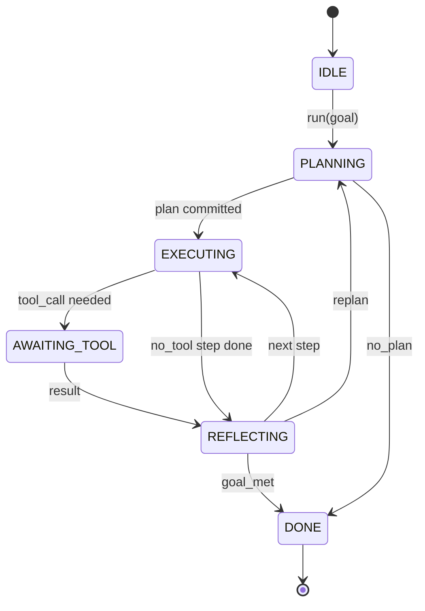

# Agent Harness 循环契约

> Harness 就是 agent。模型是协处理器。本节课固定了可以接入任何模型的循环契约。

**类型：** 构建
**语言：** Python
**前置要求：** 阶段13第01-07课，阶段14第01课
**时间：** ~90分钟

## 学习目标
- 将 agent harness 循环规范为具有显式转换的确定性状态机。
- 实现10个生命周期钩子主题，运维人员可将策略、遥测和防护栏接入其中。
- 定义两个拉取点，循环在这些点将控制权交还给调用者，并在获得新输入后恢复。
- 强制执行每个会话的预算（轮次、工具调用、墙钟时间），超出时不会泄露部分状态。
- 发出11种事件类型的类型化流，以便下游UI和追踪器无需直接检查循环即可订阅。

## 框架

一个无人值守运行40轮的编码agent不是聊天循环。它是一个状态机，运维人员可以拦截其节点并审计其边。一旦你写下契约，交换模型、工具或策略就不再是重构，而是变成一个注册调用。

本节课构建了这个契约。我们命名了6个状态、10个钩子主题、2个拉取点、11种事件类型和一个预算包络。harness中的其他所有内容（工具注册表、JSON-RPC传输、调度器、规划器）都插入到这个形状中。

## 状态

循环有6个状态。5个是活动状态，1个是终止状态。



`IDLE`是唯一的合法入口点。`DONE`是唯一的合法出口。`AWAITING_TOOL`是唯一产生拉取点的状态。所有其他转换都是内部的。

状态机是确定性的。给定相同的事件日志，harness会重新进入相同的状态。这个属性使你可以重放会话进行调试，而无需重新调用模型。

## 钩子主题

钩子是运维人员接入循环的接缝。harness触发10个主题。每个主题接受任意数量的订阅者。订阅者按注册顺序触发。订阅者可以修改负载、抛出异常以中止当前轮次，或返回哨兵值以跳过下一步。

```text
before_plan         after_plan
before_tool_call    after_tool_call
before_step         after_step
on_error
on_pause
on_budget_exceeded
on_complete
```

这个形状反映了Claude Code、Cursor和OpenCode在2025年中期之前收敛的方向。名称是功能性的，不是品牌性的。阻止`rm -rf`的钩子位于`before_tool_call`中。发送OpenTelemetry span的钩子位于`after_step`中。恢复暂停会话的钩子位于`on_pause`中。

## 拉取点

循环两次让出控制权。第一次在`AWAITING_TOOL`状态，当它无法在没有工具结果的情况下取得进展时。第二次在`on_pause`事件中，当预算耗尽或钩子明确请求人工审查时。

拉取点不是异常，而是返回。调用者检查harness状态，获取harness请求的内容，然后调用`resume(payload)`。harness从停止的地方继续。这与Python生成器的形状相同。拉取点上的传输方式由你选择。在TUI中是按键，在MCP上是`tools/call`，在队列上是作业轮询。

## 事件流

循环在契约的特定点将事件追加到类型化流中。流是仅追加的，订阅者可以从任何偏移量重放。实现的11种事件类型是：

- `session.start` — 调用`run(goal)`时触发一次
- `plan.draft` — 规划器返回草稿计划时触发
- `plan.commit` — 草稿提交为活动计划后触发
- `step.start` — 每个执行步骤开始时触发
- `step.end` — 每个执行步骤结束时触发
- `tool.call` — 需要工具的步骤将控制权让给调用者时触发
- `tool.result` — 使用工具结果恢复时触发
- `tool.error` — 恢复时出现错误或钩子中止调用时触发
- `budget.warn` — 达到预算限制时触发
- `session.pause` — 循环因暂停（预算或钩子）而让出时触发
- `session.complete` — 循环到达`DONE`状态时触发一次

事件不会重复钩子负载。钩子是命令式的（修改、中止）。事件是观察性的（记录、传输）。将它们视为正交的。

## 预算包络

每个会话携带三个限制。轮次计数、工具调用计数、墙钟秒数。每轮将轮次增加1。每次工具调用将工具调用数增加1。墙钟时间在每次状态转换时检查。当任何限制达到时，循环触发`on_budget_exceeded`，发出`budget.warn`，然后在下一个拉取点以预算超出原因转换到`IDLE`状态。

预算不是终止开关，而是让出。调用者决定是扩展预算并恢复，还是关闭会话。

## 本节课不做什么

它不调用模型，不注册真实工具，不实现传输层。这些是接下来四节课的内容。本节课固定契约，以便接下来的四节课可以插入而无需重写。

`main.py`中的确定性规划器是一个替代品。它返回一个硬编码的三步计划，其中两步需要工具结果。重点是循环，而不是计划。

## 如何阅读代码

`HarnessLoop`是主类。它维护状态、触发钩子、发出事件。`Budget`跟踪限制。`Event`是流上的类型化信封。`HookRegistry`是分发表。`_transition`是唯一改变状态的函数，因此状态机不变式位于一个地方。

从上到下阅读`main.py`。然后阅读`code/tests/test_loop.py`。测试固定了每次转换和每次钩子触发顺序。

## 进一步探索

在生产环境中构建harness最难的部分不是状态机，而是使契约可执行。契约必须经受规划器的热重载，必须经受返回格式错误JSON的工具，必须经受在40轮会话进行到三分之二时在`before_tool_call`中抛出异常的钩子。本节课中的测试涵盖了这些故障模式。运行它们，破坏它们，添加用例。

下一节课添加工具注册表。然后是JSON-RPC传输。然后是调度器。到第24课时，这个文件中的循环将针对真实工具运行真实计划，并执行真实预算。