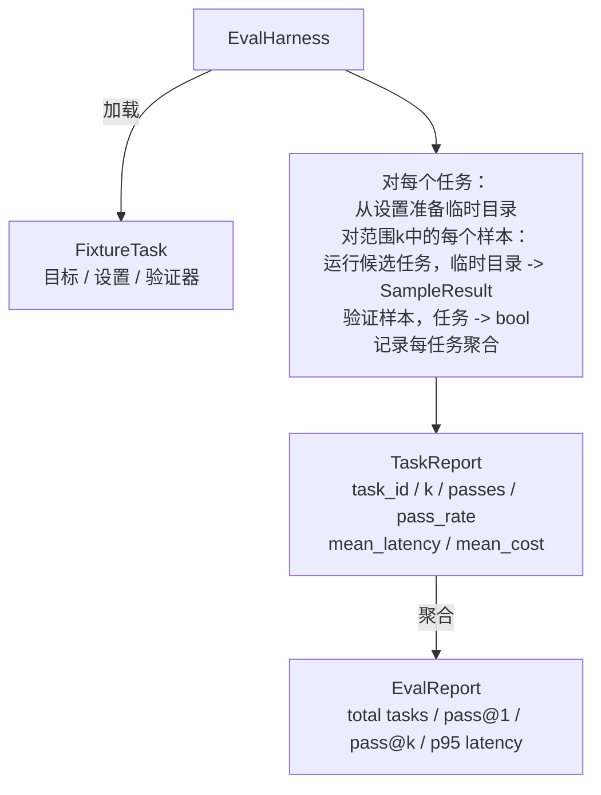

# 毕业项目第27课：带Fixture任务的评估Harness

> 一个编码agent的好坏取决于你用来衡量它的任务集。本节课构建一个评估harness，它接收一组fixture任务，通过候选agent运行每个任务，通过确定性验证器计算通过或失败，并将结果聚合为pass@1、pass@k、平均延迟和平均成本。harness是区分回归和重构的权威来源。

**类型：** 构建
**语言：** Python（标准库）
**前置要求：** 阶段19第25课（验证门）、阶段19第26课（沙箱运行器）、阶段14第30课（评估驱动的agent开发）、阶段14第19课（SWE-bench和GAIA基准）
**时间：** ~90分钟

## 学习目标

- 将fixture任务定义为三元组：目标、设置和验证器。
- 对每个任务进行多次采样运行，计算pass@1和pass@k。
- 将延迟和成本聚合为平均值和第95百分位数指标。
- 将确定性验证器（文件差异、退出码、正则表达式匹配）连接到可复用函数中。
- 发出结构化JSON报告，供回归跟踪脚本使用。

## 问题

没有评估harness构建的agent基准测试会受到三种故障模式的困扰。

第一种是未经验证的通过。agent说它修复了bug，人类瞥了一眼差异，套件被标记为绿色，三周后回归测试出现了同样的bug。agent进行了看似合理的推理，但没有真正修复任何东西。

第二种是未检测到的回归。对提示模板的修改使agent在显眼任务上提高了4%，在隐蔽任务上降低了14%。如果没有黄金集和每任务分数，回归会进入主分支，只有当客户抱怨时才会显现。

第三种是每任务漂移。评估在周一使用100个任务运行，在周五使用95个运行，因为有人重命名了五个fixture。通过率看起来提高了5%。实际上并非如此。

harness是将这些故障转化为事实的程序。它运行每个fixture，每次以可重现的顺序，针对一个在确定性检查上返回true或false的验证器。

## 概念

```mermaid
flowchart LR
  F1[fixtures/task_001/<br/>task.json + expected/] --> Harness
  F2[fixtures/task_002/<br/>...] --> Harness
  Harness[Harness<br/>对每个任务：<br/>设置 / 运行agent k个样本 /<br/>验证每个样本 /<br/>记录延迟、成本]
  Harness --> Report[EvalReport<br/>pass@1 / pass@k<br/>平均ms / p95 ms<br/>平均成本]
```

`FixtureTask`是一个小型JSON文件加上一个可选的`expected/`目录。JSON声明了`id`、`goal`（提供给agent的提示）、`setup`块（要放入临时目录的文件）和`verifier`块。验证器块命名harness验证器注册表中的一个函数并提供其参数。

三种验证器形状覆盖了大多数有用的任务。

第一种是`file_equals`。在agent运行后，将命名文件与预期内容进行比较。这捕获了"以确切方式修复此bug"的任务。

第二种是`regex_match`。命名文件的内容与正则表达式匹配。这捕获了"函数必须存在并返回X"的任务，其中有许多可接受的解决方案。

第三种是`shell_exit_zero`。harness运行shell命令（通过第26课的沙箱），只有当命令退出码为零时才通过任务。这捕获了"测试必须通过"的任务。

harness运行每个任务`k`次。Pass@k是`1 - (1 - p)^k`，其中p是经验通过率；harness还报告原始计数，以便你可以发现方差。延迟是每个样本的墙钟时间。成本是agent自我报告的内容（token计数、美元或两者）；harness在样本间求和并呈现每任务和聚合数字。

```figure
pass-at-k
```

## 架构



候选者是一个可调用对象：`Callable[[FixtureTask, str], SampleResult]`。harness通过`tempfile.mkdtemp()`创建临时目录，并将其路径作为普通字符串传递。harness不关心候选者如何工作。候选者可以是确定性补丁应用器（用于harness自测试）、真实LLM agent、模糊器。契约是SampleResult。

## 你将构建什么

`main.py`提供：

1. `FixtureTask`数据类。
2. `SampleResult`数据类：success_self_reported、latency_ms、cost_units、edits。
3. `TaskReport`、`EvalReport`数据类，带有`to_dict()`。
4. `VerifierRegistry`将验证器名称映射到函数。内置验证器：file_equals、regex_match、shell_exit_zero。
5. `EvalHarness`类。运行一组任务对候选者。返回EvalReport。
6. `tasks/`中捆绑的五个fixture任务：
   - `fizzbuzz`中的差一错误
   - `factorial`中缺失的return
   - 错误消息中的拼写错误
   - 空函数体
   - 链表遍历中的差一错误
7. 确定性参考候选者（`apply_known_fixes`），harness用于演示1.0的clean pass@1。
8. 演示打印EvalReport JSON并以零退出。

fixture任务作为JSON文件捆绑在`tasks/`中，配套源文件在`tasks/<id>/buggy/`和`tasks/<id>/expected/`中。harness将buggy复制到临时目录，交给候选者，并针对expected进行验证。

## 为什么使用pass@k而不仅仅是pass@1

真实LLM agent是随机的。0.6的pass@1看起来像失败。0.95的pass@5表示agent大多数时候能得到正确答案，但在早期样本上选择了错误的答案。修复是采样和排名，而不仅仅是更多训练。Pass@k使其可见。

Pass@k与pass@1一起报告，因为pass@k掩盖了一个真实的失败：如果模型在二十次尝试中得到一次正确答案，你并没有一个有用的agent。harness同时显示两者。

## 如何与Track A的其余部分组合

第25课产生了门链。第26课产生了沙箱。harness将沙箱用于任何`shell_exit_zero`验证器。第28课将每次harness运行包装在OTel跟踪中。第29课针对捆绑的fixture之一运行端到端演示，并断言参考候选者的pass@1 = 1.0。

## 运行它

```bash
cd phases/19-capstone-projects/27-eval-harness-fixture-tasks
python3 code/main.py
python3 -m pytest code/tests/ -v
```

演示以JSON格式打印EvalReport，包括pass@1、pass@5、平均延迟和每任务细分。退出码为零。测试覆盖验证器函数、pass@k数学、fixture加载和harness端到端对捆绑参考候选者的测试。