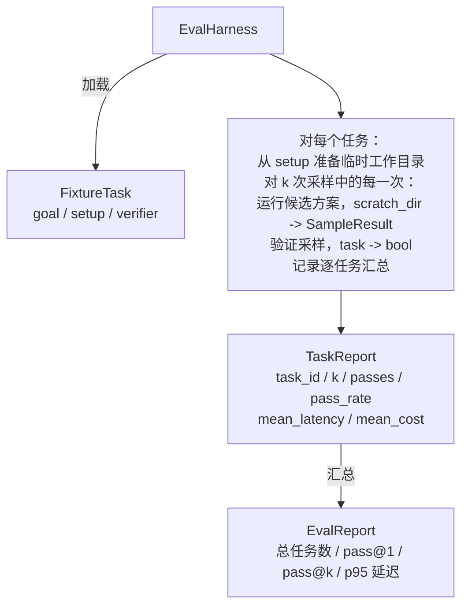

# 综合项目第 27 课：基于 Fixture 任务的评测框架

> 一个编码智能体的好坏，取决于你用来衡量它的任务集的质量。本课构建一个评测框架（eval harness），它接收一个包含 fixture 任务的文件夹，将每个任务交由候选智能体执行，通过确定性验证器（verifier）判断通过或失败，并将结果汇总为 pass@1、pass@k、平均延迟和平均成本。这个评测框架就是真相的来源，让你能够区分一次回归（regression）和一次重构（refactor）。

**类型：** 构建
**语言：** Python（标准库）
**前置要求：** Phase 19 · 25（验证门控）、Phase 19 · 26（沙箱运行器）、Phase 14 · 30（评估驱动的智能体开发）、Phase 14 · 19（SWE-bench 和 GAIA 基准测试）
**时间：** 约 90 分钟

## 学习目标

- 将一个 fixture 任务定义为由目标（goal）、前置准备（setup）和验证器（verifier）组成的三元组。
- 对每个任务进行多次采样运行，并计算 pass@1 和 pass@k。
- 将延迟和成本汇总为平均值和 P95 百分位指标。
- 将确定性验证器（文件差异比较、退出码检查、正则匹配）封装为可复用的函数。
- 输出结构化的 JSON 报告，可供回归跟踪脚本直接读取。

## 问题

没有评测框架支撑的智能体基准测试存在三种典型的失败模式。

第一种是未经验证的通过。智能体声称修好了 bug，人类粗略扫一眼 diff，测试套件就标绿了，三周后回归测试又把同一个 bug 翻了出来。智能体的推理看起来合理，但实际上什么都没修好。

第二种是未被发现的回归。对 prompt 模板的一处改动，让智能体在某个显眼的任务上提升了 4%，却在另一个不显眼的任务上下降了 14%。没有黄金标准（goldset）和逐任务的评分，这次回归就会悄无声息地合入主分支，直到客户投诉才暴露出来。

第三种是逐任务漂移。周一的评测用了 100 个任务，周五只剩 95 个，因为有人重命名了五个 fixture。通过率看起来提升了 5%——实际上并非如此。

评测框架（harness）就是将这些失败转化为事实的程序。它每次运行所有 fixture，以可复现的顺序，针对返回 true 或 false 的确定性检查来验证。

## 概念

```mermaid
flowchart LR
  F1[fixtures/task_001/<br/>task.json + expected/] --> Harness
  F2[fixtures/task_002/<br/>...] --> Harness
  Harness[评测框架<br/>对每个任务：<br/>setup / 运行 agent k 次采样 /<br/>验证每次采样 /<br/>记录延迟、成本]
  Harness --> Report[EvalReport<br/>pass@1 / pass@k<br/>平均毫秒 / p95 毫秒<br/>平均成本]
```

`FixtureTask` 是一个小型 JSON 文件外加一个可选的 `expected/` 目录。JSON 声明了 `id`、`goal`（喂给智能体的 prompt）、`setup` 块（要放入临时工作目录的文件）以及 `verifier` 块。verifier 块指定了评测框架验证器注册表中的某个函数名，并提供其参数。

三种验证器形态覆盖了大多数有用任务的场景。

第一种是 `file_equals`。智能体运行完毕后，将指定文件与预期内容进行比较。这适用于"用这种确切方式修复这个 bug"的任务。

第二种是 `regex_match`。将指定文件的内容与正则表达式进行匹配。这适用于"函数必须存在并返回 X"这类存在多种可接受解法的任务。

第三种是 `shell_exit_zero`。评测框架运行一条 shell 命令（通过第 26 课的沙箱），仅当命令以零退出时才判定任务通过。这适用于"测试必须通过"的任务。

评测框架对每个任务运行 `k` 次。pass@k 的计算公式为 `1 - (1 - p)^k`，其中 p 是经验通过率；评测框架同时报告原始计数，以便你发现波动。延迟是每次采样的墙上时钟时间。成本是智能体自行报告的内容（token 数量、美元金额或两者皆有）；评测框架将所有采样的成本汇总，给出逐任务的和汇总的数字。

## 架构



候选方案是一个可调用对象：`Callable[[FixtureTask, str], SampleResult]`。评测框架通过 `tempfile.mkdtemp()` 创建临时工作目录，并将其路径作为普通字符串传入。评测框架不关心候选方案的具体实现方式。候选方案可以是确定性补丁应用器（适合评测框架自测）、真实的 LLM 智能体，或是一个模糊测试工具。契约就是 SampleResult。

## 你将构建的内容

`main.py` 包含：

1. `FixtureTask` 数据类。
2. `SampleResult` 数据类：`success_self_reported`、`latency_ms`、`cost_units`、`edits`。
3. `TaskReport`、`EvalReport` 数据类，带 `to_dict()` 方法。
4. `VerifierRegistry`，将验证器名称映射到函数。内置验证器：`file_equals`、`regex_match`、`shell_exit_zero`。
5. `EvalHarness` 类。对一个目录中的任务集合运行候选方案。返回 `EvalReport`。
6. 五个捆绑在 `tasks/` 中的 fixture 任务：
   - `fizzbuzz` 中的 off-by-one 错误
   - `factorial` 中的缺失 return
   - 错误信息中的拼写错误
   - 空函数体
   - 链表遍历中的 off-by-one 错误
7. 一个确定性参考候选方案（`apply_known_fixes`），评测框架用它来演示干净利落的 pass@1 = 1.0。
8. 演示程序打印 EvalReport JSON 并以零退出。

fixture 任务以 JSON 文件形式打包在 `tasks/` 中，同时附带源文件，分别位于 `tasks/<id>/buggy/` 和 `tasks/<id>/expected/`。评测框架将 buggy 文件复制到临时目录，交给候选方案，然后与 expected 文件进行比较验证。

## 为什么需要 pass@k 而不仅仅是 pass@1

真实的 LLM 智能体是随机性的。pass@1 为 0.6 看起来像一次失败。pass@5 为 0.95 则说明智能体大多数时候能给出正确答案，只是在早期的采样中选错了方向。修复方式是采样加排序，而不一定是更多的训练。pass@k 让这一点变得可见。

pass@k 与 pass@1 并列报告，因为 pass@k 会掩盖一种真正的失败：如果模型二十次尝试中只有一次得到了正确答案，那你拥有的并不是一个有用的智能体。评测框架同时展示两者。

## 本课如何与 Track A 的其他部分组合

第 25 课产出了门控链。第 26 课产出了沙箱。本评测框架在 `shell_exit_zero` 验证器中使用了沙箱。第 28 课将每次评测框架运行包裹在 OTel trace 中。第 29 课将用一个捆绑的 fixture 运行端到端演示，并断言参考候选方案的 pass@1 = 1.0。

## 运行方式

```bash
cd phases/19-capstone-projects/27-eval-harness-fixture-tasks
python3 code/main.py
python3 -m pytest code/tests/ -v
```

演示程序以 JSON 格式打印 EvalReport，包括 pass@1、pass@5、平均延迟以及逐任务分解。退出码为零。测试覆盖了验证器函数、pass@k 的数学计算、fixture 加载以及评测框架与捆绑参考候选方案的端到端测试。
