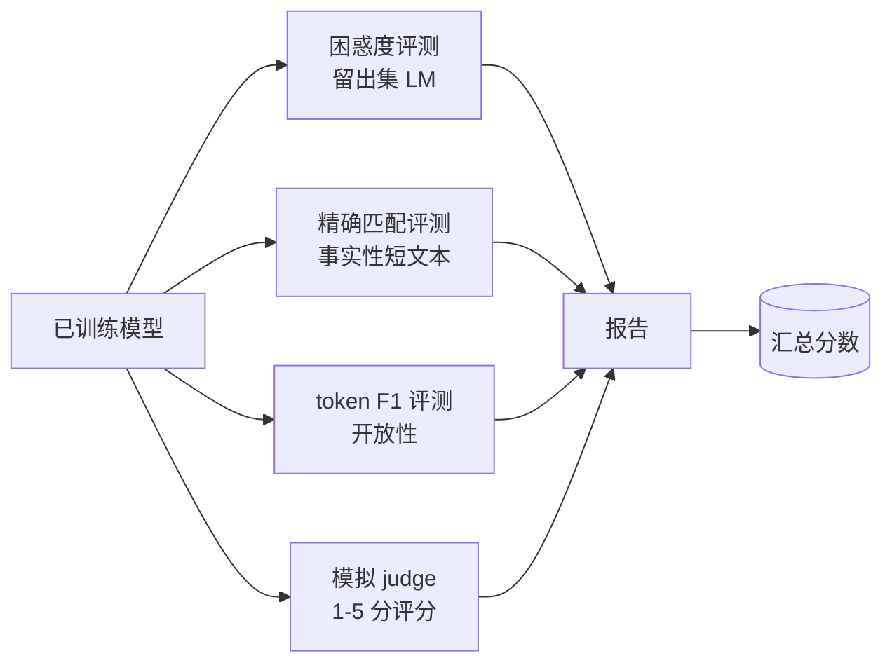
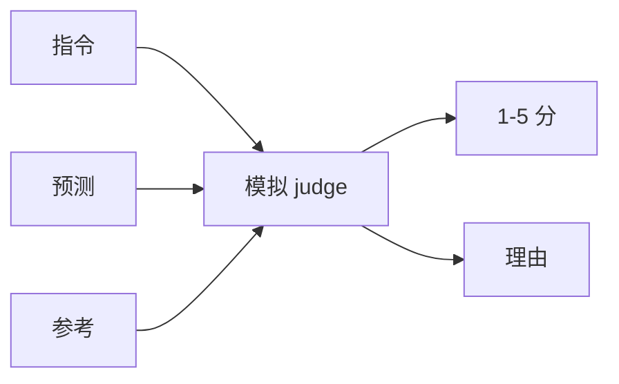
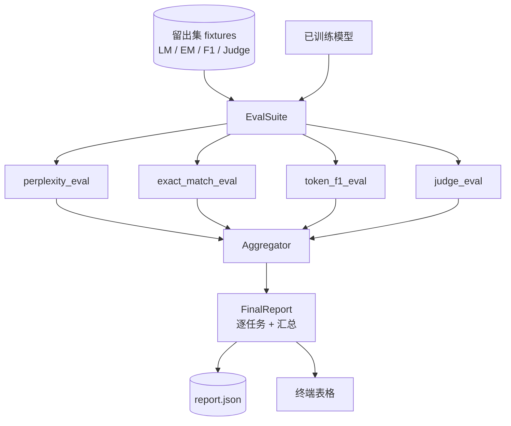

# 综合项目第 41 课：完整评测流水线

> 训练是你可以用损失曲线监控的部分。评测是你必须自己设计的部分。本课构建一个统一的评测流水线，接收任意已训练的语言模型，运行四种异构评测，将结果聚合为逐任务报告，并提供一个本地的模拟 LLM-as-judge，使整个循环无需网络即可运行。四种评测覆盖了每个发布模型所需的维度：语言建模（困惑度）、短文本正确性（精确匹配）、开放性相似度（token F1）和定性评分（judge）。

**类型：** 构建
**语言：** Python（torch、numpy）
**前置要求：** Phase 19 课程 30-37（NLP LLM 路线：分词器、嵌入表、注意力块、Transformer 主体、预训练循环、检查点、生成、困惑度）
**时间：** 约 90 分钟

## 学习目标

- 在微型 Transformer 上使用遮蔽 token 计算留出集困惑度。
- 对短文本事实性 prompt 运行精确匹配评测。
- 使用归一化计算预测字符串与参考字符串之间的 token 级 F1。
- 构建一个本地模拟 LLM-as-judge，对模型输出进行 1-5 分评分。
- 将四种评测聚合为带逐任务分解的加权报告。

## 问题

单一指标永远无法描述一个语言模型。困惑度说明模型拟合语言分布的程度，但无法说明它是否能回答问题。精确匹配说明模型是否生成了黄金字符串，但会惩罚正确的改述。Token F1 宽容改述，但会被错误内容的词汇重叠所迷惑。LLM-as-judge 捕获定性维度，但昂贵且具有随机性。

你真正需要的流水线包含全部四种。每种评测覆盖其他评测遗漏的维度。每种评测运行在针对该指标组织的不同留出数据子集上。最终报告并排展示逐任务数字和汇总值，审查者可以一眼看出模型在做哪些权衡。

本课在一个文件中端到端地构建这条流水线。

## 概念

每种评测是一个 `(model, dataset) -> EvalResult` 的函数。结果包含指标值、供检查的逐样本详情以及用于聚合的名称。流水线通过配置将它们组合在一起，配置说明运行哪些评测以及如何加权。

## 正确计算困惑度

困惑度是 `exp(每个 token 的平均负对数似然)`。实现中有两个陷阱：

- 均值必须在实际 token 位置上计算，而非 batch × sequence。填充 token 必须从分母中排除，否则困惑度会比实际更好看。
- 模型预测下一个 token，因此位置 `i` 处的 logits 预测的是位置 `i+1` 处的 token。此处的 off-by-one 错误是静默的：损失仍然可以训练，但指标变得毫无意义。

评测计算每个 batch 中非填充位置的 `-log p(token)` 之和以及每个 batch 的 token 计数，最后再相除。这比逐 batch 平均困惑度（会低估短序列的权重）在数值上更安全，且与教科书定义一致。

## 带归一化的精确匹配

评测框架在比较前对预测和参考进行归一化：

- 转小写。
- 去除首尾空白。
- 将内部连续空白折叠为单个空格。
- 如果两侧仅在标点上不同，去除末尾的终止标点（`.`、`!`、`?`）。

归一化使精确匹配在实践中可用。模型回答 `"Paris"` 是正确的；回答 `"Paris."` 也是正确的；回答 `"  paris  "` 同样正确。该指标仍然要求归一化后的字符串完全相同。

## 正确的 Token F1

Token F1 是在 token 词袋上计算的精确率和召回率的调和平均值。步骤：

1. 归一化预测和参考（与精确相同的规则）。
2. 将每个拆分为 token 列表（按空白分词）。
3. 计算多重集交集。
4. 精确率 = `交集计数 / len(pred_tokens)`。召回率 = `交集计数 / len(ref_tokens)`。F1 = 调和平均值。

如果预测和参考都为空，F1 为 1（空匹配）。如果只有一个为空，F1 为 0。此模式与 SQuAD 评测参考一致，在各种改述中产生稳定的数值。

## 本地模拟 LLM-as-Judge

真正的 judge 是通过 API 调用的前沿模型。本课中 judge 必须离线运行。模拟 judge 是一个确定性评分器，接收指令、模型预测和参考，返回 `{1, 2, 3, 4, 5}` 中的分数以及一行理由。评分规则是明确的：

- 如果归一化后的预测等于归一化后的参考，5 分。
- 如果预测与参考之间的 token F1 至少为 0.8，4 分。
- 如果 token F1 在 `[0.5, 0.8)` 范围内，3 分。
- 如果 token F1 在 `[0.2, 0.5)` 范围内，2 分。
- 其他情况 1 分。

这不是真正的 judge，但它有正确的接口。之后只需更改一个函数即可替换为真正的模型。流水线不关心具体实现。

## 聚合

汇总值是归一化评测分数的加权平均值。每种评测报告其在 `[0, 1]` 范围内的数值：

- 困惑度：归一化为 `1 / (1 + log(perplexity))`。困惑度为 1 映射到 1，无穷大映射到 0。
- 精确匹配：已在 `[0, 1]` 范围内。
- Token F1：已在 `[0, 1]` 范围内。
- Judge：除以 5。

权重可配置。默认组合为 0.2 困惑度、0.3 精确匹配、0.3 token F1、0.2 judge。权重的选择是产品决策；本课暴露该旋钮以便你进行实验。

## 架构

`EvalSuite` 是一个轻量编排器。每个独立评测是一个自由函数，接收 `(model, tokenizer, dataset, config)` 并返回 `EvalResult`。`Aggregator` 收集结果并生成最终报告。演示程序打印表格并写入一份 JSON 副本，供下游 CI 使用。

## 你将构建的内容

实现包含一个 `main.py` 加测试。

1. `TinyGPT`：与课程 38-40 中相同的仅解码器架构，包含在内使本课可独立运行。
2. `InstructionTokenizer`：带 INST / RESP / PAD 特殊标记的字节分词器。
3. 四个 fixture：一个 LM 语料库、一个 EM 集、一个 F1 集和一个 Judge 集。每个二十个样本，确定性的。
4. `perplexity_eval`：返回包含困惑度值和逐 token 损失直方图的 `EvalResult`。
5. `exact_match_eval`：返回平均精确匹配和逐样本记录。
6. `token_f1_eval`：返回平均 token F1 和逐样本记录。
7. `mock_judge` 和 `judge_eval`：逐样本分数和理由，以及整个集合的平均分数。
8. `Aggregator.normalise`：逐评测归一化规则。
9. `Aggregator.aggregate`：加权平均值和组装的报告。
10. `run_demo`：简短训练一个微型模型，运行全部四种评测，打印报告表格并写入 JSON，成功时以零退出。

## 阅读报告

报告有三层。顶层是汇总分数。其下是四个逐评测数字。再下是用于诊断的逐样本分解。失败的 CI 运行通常关注汇总值，但追踪回归的审查者需要逐样本分解来查看模型在哪些输入上出错。

JSON 输出使用稳定的键名，以便 CI 仪表板可以跨版本绘制趋势线。格式化的表格供训练运行后在终端查看的人使用。

## 进阶目标

- 添加校准评测：模型的 softmax 概率是否与其准确率匹配？按置信度对预测分桶，报告每个桶的经验准确率。
- 添加鲁棒性评测：为每个样本标注扰动（拼写错误、改述、干扰项），报告每个扰动下的指标下降。
- 用 HTTP 调用的真正模型替换模拟 judge。函数签名不变。
- 添加逐任务权重学习：不使用固定权重，而是拟合权重以匹配跨模型的目标偏好顺序。

实现提供了四种评测、聚合器和报告。真正的评测流水线在此基础上叠加更多维度；模式保持不变：每个评测一个函数、一个聚合器、一份报告。
