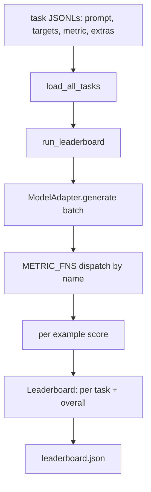
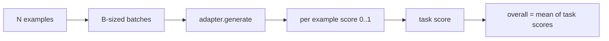

# 语言模型评估Harness

> 一个在你无法定义的任务上表现良好的模型是偶然表现良好的模型。harness是任务定义、指标、运行器和排行榜，都在一个简短、可交换的形状中。

**类型：** 构建
**语言：** Python
**前置要求：** 阶段19第42至45课
**时间：** ~90分钟

## 学习目标

- 将任务定义为JSONL文件，每个示例包含`prompt`、`targets`、`metric`和可选的`extras`。
- 实现五种指标：精确匹配、rouge-l F1、可执行检查、多选题和子串包含。
- 构建一个运行器，按任务批处理示例并分派到可交换的模型适配器。
- 发出一个排行榜JSON，包含每任务分数、延迟和可重现的总体平均值。

## 问题

每周都有新的语言模型发布。营销声称它表现良好。诚实的问题是：在什么方面表现良好？诚实的答案是你自己编写的排行榜，因为供应商的排行榜是他们调整过的。

没有harness在你的仓库中，你通过感觉比较两个模型。有了harness，你通过固定任务集上的固定指标分数比较它们，在你可以diff的JSON输出上。harness是昨天运行和今天运行之间的契约。没有它，回归就会发布。

陷阱是将harness过度拟合到单个模型。修复是同样的陷阱反向操作：harness足够小，可以在十五分钟内读完；任务足够小，可以放在仓库中发布；指标从头开始编写，以便同事可以审计；适配器是唯一放置模型特定代码的地方。交换适配器，排行榜移动；交换任务，排行榜移动。其他任何东西都不应该移动。

## 概念



### 任务规范

每个示例是JSONL的一行：

```json
{"id": "arith-00", "prompt": "compute: 2 + 2", "targets": ["4"], "metric": "exact_match"}
```

对于需要评分辅助函数的指标，`extras`携带侧负载：

```json
{
  "id": "code-00",
  "prompt": "python: write a function f that doubles its input",
  "targets": ["ok"],
  "metric": "code_exec",
  "extras": {"io_pairs": [[1, 2], [3, 6]]}
}
```

任务是`outputs/tasks/`下的`.jsonl`文件。文件名是任务名称。文件中的所有示例共享一个指标。

### 五个fixture任务

| 任务 | 指标 | 测试内容 |
|------|------|----------|
| arithmetic | exact_match | 确定性答案的token级正确性 |
| summary | rouge_l | 对单行参考摘要的最长公共子序列F1 |
| code-exec | code_exec | 可执行测试：预测函数必须满足输入输出对列表 |
| multiple-choice | multiple_choice | 预测的第一个字母必须匹配允许的字母 |
| generation | substring_contains | 自由格式文本必须包含至少一个目标子串 |

### 指标契约

每个指标是从`(prediction, targets, extras) -> float in [0.0, 1.0]`的函数。harness对每示例分数取平均值以获得任务分数，然后对任务分数取平均值以获得总体分数。指标函数很小：

- `exact_match`：小写，压缩空白，相等。
- `substring_contains`：相同规范化，子串测试。
- `multiple_choice`：第一个字符大写。
- `rouge_l`：LCS长度除以预测和参考的长度，精确率和召回率的F1。
- `code_exec`：在受限命名空间中执行预测，在每个输入输出对上调用`f(x)`，计算匹配数。

code_exec指标在精简的内置命名空间中运行预测。本节课的测试断言`import os`会崩溃，因为`os`不在命名空间中；你无法从代码预测中访问文件系统。

### 模型适配器

```python
class ModelAdapter(Protocol):
    def generate(self, prompts: Sequence[str]) -> List[str]: ...
    @property
    def name(self) -> str: ...
```

适配器是接缝。本节课提供`ToyAdapter`，一个确定性模式匹配器，为五个fixture任务中的每个提示返回正确答案。真实适配器调用模型并返回其输出。harness不关心哪个。

### 运行器

`run_task`每次批量处理`batch_size`个提示并分派到指标函数。`run_leaderboard`遍历每个任务并取平均值。`write_leaderboard`发出带有schema字符串的JSON，以便未来的格式更改不会悄悄破坏仪表板。



```figure
eval-harness-matrix
```

## 构建它

`code/main.py`是可运行的工件。

### 步骤1：创建fixture任务

`seed_fixture_tasks(target_dir)`写入五个`.jsonl`文件。`main.py`的第一次运行在目录为空时创建它们。

### 步骤2：加载任务

`load_all_tasks(task_dir)`读取每个`.jsonl`并返回从任务名称到`Example`记录列表的字典。以`#`开头的注释行和空行被跳过，以便贡献者可以注释文件。

### 步骤3：实现指标

每个指标是一个带有单元测试的小函数。本节课的测试套件包含13个用例，涵盖规范化、部分重叠、代码执行和不安全代码拒绝。

### 步骤4：编写运行器

`run_task`迭代批处理并生成带有分数、正确计数、总计数和延迟的`TaskResult`。`run_leaderboard`遍历所有任务并生成带有总体平均值的`Leaderboard`。

### 步骤5：发出JSON

`write_leaderboard`序列化排行榜。`--include-per-example`标志转储每示例记录，以便在分数移动时你可以diff预测与上次运行。

运行它：

```bash
python3 code/main.py
```

该脚本在第一次运行时创建fixture，使用玩具适配器（正确回答所有fixture）对它们评分，并写入`outputs/leaderboard.json`。使用玩具适配器的总体分数是1.0；`test_main.py`中的存根适配器测试显示，当适配器无法回答时，相同的harness产生0.0。

## 使用它

要插入真实模型，编写适配器。形状：

```python
class HttpAdapter:
    name = "vendor.v1"

    def __init__(self, endpoint, api_key):
        self.endpoint = endpoint
        self.api_key = api_key

    def generate(self, prompts):
        out = []
        for prompt in prompts:
            response = http_post(self.endpoint, prompt, self.api_key)
            out.append(response["text"])
        return out
```

在`main()`顶部将`ToyAdapter`替换为`HttpAdapter`。harness、任务、指标和排行榜保持不变。

在真实项目中发布harness时要执行的三种模式：

- **固定任务文件。**排行榜.json携带哈希固定的任务内容或携带JSONL；否则当任务文件移动时分数移动，你无法分辨是哪个。
- **Diff预测，而不仅仅是分数。**`--include-per-example`标志让你在分数下降的那天看到模型说了什么。
- **限制批处理大小。**真实适配器有速率限制。小批处理大小使harness跨供应商兼容。

## 发布它

`outputs/skill-lm-eval-harness.md`携带配方：JSONL任务规范、五种指标、可交换适配器、批处理运行器、带有schema字符串的排行榜JSON。`outputs/tasks/中的任务文件是fixture；将它们复制到真实项目中作为入门文件。

## 练习

1. 添加第六个任务，使用从头开始编写的自定义指标（类似BLEU的重叠、类似BLEURT的参考评分，任何具有明确契约的指标）。
2. 扩展`code_exec`以捕获stdout并接受预期stdout列表作为目标。
3. 添加排行榜diff命令：给定两个`leaderboard.json`文件，打印哪些任务移动以及移动了多少。
4. 限制每个示例的延迟。将适配器调用包装在超时中；在排行榜中显示单独的`timeouts`列。
5. 使用sha256固定任务内容，以便未来的读者可以验证他们评分的是相同的任务。

## 关键术语

| 术语 | 人们怎么说 | 实际含义 |
|------|------------|----------|
| 任务规范 | "评估格式" | 每个示例包含prompt、targets、metric、可选extras的JSONL文件 |
| 指标 | "你如何评分" | 从(prediction, targets, extras)到[0, 1]中浮点数的函数 |
| 适配器 | "模型客户端" | 具有generate(prompts) -> list[str]方法的对象；唯一的模型特定代码 |
| 排行榜 | "计分板" | 包含每任务分数、总计数、延迟和总体平均值的JSON |
| 代码执行指标 | "运行并检查" | 在受限命名空间中执行预测，与输入输出对进行比较 |

## 进一步阅读

- 原始的lm-evaluation-harness作为生产参考，更大但形状相同。
- HuggingFace的lighteval作为相同契约的替代实现。
- 阶段19第46课涵盖了harness评分的训练堆栈中使用的梯度累积模式。
- 阶段19第47课涵盖了你评分的检查点格式；在排行榜中固定检查点哈希。
- 阶段19第48课涵盖了产生被测模型的分布式训练堆栈。