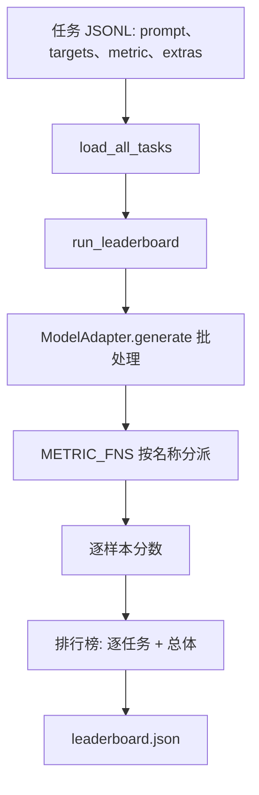
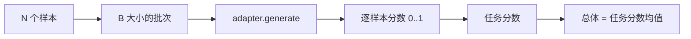

# 语言模型评测框架

> 一个在你无法定义的任务上表现良好的模型，只是碰巧表现良好。评测框架就是任务定义、指标、运行器和排行榜，封装在一个简短、可替换的形态中。

**类型：** 构建
**语言：** Python
**前置要求：** Phase 19 课程 42 至 45
**时间：** 约 90 分钟

## 学习目标

- 将任务定义为 JSONL 文件，每行包含 `prompt`、`targets`、`metric` 和可选的 `extras`。
- 实现五种指标：精确匹配、ROUGE-L F1、可执行检查、多选题和子串包含。
- 构建一个按任务批处理样本并分派到可替换模型适配器的运行器。
- 输出带逐任务分数、延迟和可复现总体平均值的排行榜 JSON。

## 问题

每周都有新的语言模型发布。营销声称它表现很好。诚实的问题是：好在哪里？诚实的答案是你自己编写的排行榜，因为厂商的排行榜是他们专门调优过的。

没有评测框架在仓库中，你比较两个模型靠的是感觉。有了评测框架，你比较它们靠的是在固定任务集、固定指标上的分数，输出是可 diff 的 JSON。评测框架是昨天运行和今天运行之间的契约。没有它，回归就会悄悄上线。

陷阱是将评测框架过度适配到单个模型。反过来解套：评测框架小到十五分钟能读完，任务小到可以随仓库分发，指标从零编写以便同事审查，适配器是唯一包含模型特定代码的地方。替换适配器，排行榜变化；替换任务，排行榜变化。其他东西不应变化。

## 概念



### 任务规范

每个样本是一行 JSONL：

```json
{"id": "arith-00", "prompt": "compute: 2 + 2", "targets": ["4"], "metric": "exact_match"}
```

对于需要辅助评分信息的指标，`extras` 携带附加数据：

```json
{
  "id": "code-00",
  "prompt": "python: write a function f that doubles its input",
  "targets": ["ok"],
  "metric": "code_exec",
  "extras": {"io_pairs": [[1, 2], [3, 6]]}
}
```

任务是 `outputs/tasks/` 下的 `.jsonl` 文件。文件名即任务名。同一文件中的所有样本共享同一个指标。

### 五个 fixture 任务

| 任务 | 指标 | 测试内容 |
|------|------|---------|
| arithmetic | exact_match | 对确定性答案的 token 级正确性 |
| summary | rouge_l | 与单行参考摘要的最长公共子序列 F1 |
| code-exec | code_exec | 可执行测试：预测函数必须满足一组输入-输出对 |
| multiple-choice | multiple_choice | 预测的首字母必须匹配允许的字母 |
| generation | substring_contains | 自由文本必须包含至少一个目标子串 |

### 指标契约

每个指标是 `(prediction, targets, extras) -> float in [0.0, 1.0]` 的函数。评测框架将逐样本分数平均得到任务分数，再将任务分数平均得到总体分数。指标函数都很简短：

- `exact_match`：转小写，折叠空白，判断相等。
- `substring_contains`：相同归一化，子串测试。
- `multiple_choice`：取首字母并转大写。
- `rouge_l`：LCS 长度除以预测和参考的长度，精确率和召回率的 F1。
- `code_exec`：在受限命名空间中执行预测，在每个输入-输出对上调用 `f(x)`，统计匹配数。

`code_exec` 指标在精简的内置命名空间中执行预测。本课的测试断言 `import os` 会报错，因为 `os` 不在命名空间中；你无法从代码预测中访问文件系统。

### 模型适配器

```python
class ModelAdapter(Protocol):
    def generate(self, prompts: Sequence[str]) -> List[str]: ...
    @property
    def name(self) -> str: ...
```

适配器是接口。本课提供 `ToyAdapter`，一个确定性的模式匹配器，为五个 fixture 任务中的每个 prompt 返回正确答案。真正的适配器调用模型并返回其输出。评测框架不关心具体实现。

### 运行器

`run_task` 按 `batch_size` 大小批处理 prompt 并分派到指标函数。`run_leaderboard` 遍历所有任务并求平均。`write_leaderboard` 输出带 schema 字符串的 JSON，以便未来的格式变更不会悄悄破坏仪表板。



## 构建

`code/main.py` 是可运行的制品。

### 步骤 1：生成 fixture 任务

`seed_fixture_tasks(target_dir)` 写入五个 `.jsonl` 文件。`main.py` 首次运行时，如果目录为空则生成它们。

### 步骤 2：加载任务

`load_all_tasks(task_dir)` 读取每个 `.jsonl`，返回从任务名到 `Example` 记录列表的字典。以 `#` 开头的注释行和空行会被跳过，以便贡献者可以对文件进行标注。

### 步骤 3：实现指标

每个指标是一个带单元测试的小函数。本课的测试套件包含 13 个用例，覆盖归一化、部分重叠、代码执行和不安全代码拒绝。

### 步骤 4：编写运行器

`run_task` 迭代批次并生成包含分数、正确数、总数和延迟的 `TaskResult`。`run_leaderboard` 遍历所有任务并生成带总体平均值的 `Leaderboard`。

### 步骤 5：输出 JSON

`write_leaderboard` 序列化排行榜。`--include-per-example` 标志转储逐样本记录，以便在分数变化时与上一次运行进行预测对比。

运行它：

```bash
python3 code/main.py
```

脚本在首次运行时生成 fixture，用玩具适配器（能正确回答所有 fixture）进行评分，并写入 `outputs/leaderboard.json`。使用玩具适配器时总体分数为 1.0；`test_main.py` 中的 stub 适配器测试表明，当适配器无法回答时，同一评测框架产生 0.0。

## 使用

要接入真正的模型，编写一个适配器。格式如下：

```python
class HttpAdapter:
    name = "vendor.v1"

    def __init__(self, endpoint, api_key):
        self.endpoint = endpoint
        self.api_key = api_key

    def generate(self, prompts):
        out = []
        for prompt in prompts:
            response = http_post(self.endpoint, prompt, self.api_key)
            out.append(response["text"])
        return out
```

在 `main()` 顶部将 `ToyAdapter` 替换为 `HttpAdapter`。评测框架、任务、指标和排行榜保持不变。

在实际项目中发布评测框架时需要遵守的三种模式：

- **锁定任务文件。** leaderboard.json 要么携带哈希锁定的任务内容，要么附带 JSONL 文件；否则任务文件变动时分数也会变动，你无法分辨原因。
- **对比预测结果，不仅仅是分数。** `--include-per-example` 标志让你看到分数下降那天模型到底说了什么。
- **限制 batch size。** 真正的适配器有速率限制。小 batch size 让评测框架在各厂商之间保持兼容。

## 交付

`outputs/skill-lm-eval-harness.md` 包含完整方案：JSONL 任务规范、五种指标、可替换适配器、批量运行器、带 schema 字符串的排行榜 JSON。`outputs/tasks/` 中的任务文件是 fixture；可以作为起点复制到实际项目中。

## 练习

1. 添加第六个任务，编写一个自定义指标（类似 BLEU 的重叠度、类似 BLEURT 的参考评分，任何有明确契约的指标）。
2. 扩展 `code_exec` 以捕获 stdout，并接受期望 stdout 列表作为 targets。
3. 添加排行榜对比命令：给定两个 `leaderboard.json` 文件，打印哪些任务发生了变化以及变化了多少。
4. 限制每个样本的延迟。用超时包装适配器调用；在排行榜中显示单独的 `timeouts` 列。
5. 在排行榜中用 sha256 锁定任务内容，以便未来的读者可以验证他们评分的是相同任务。

## 关键术语

| 术语 | 常见说法 | 实际含义 |
|------|---------|---------|
| 任务规范 | "评测格式" | JSONL 文件，每行包含 prompt、targets、metric、可选的 extras |
| 指标 | "评分方式" | 从 (prediction, targets, extras) 到 [0, 1] 浮点数的函数 |
| 适配器 | "模型客户端" | 带有 generate(prompts) -> list[str] 方法的对象；唯一的模型特定代码 |
| 排行榜 | "记分板" | 包含逐任务分数、总计数、延迟和总体平均值的 JSON |
| Code exec 指标 | "运行并检查" | 在受限命名空间中执行预测，与输入-输出对进行比较 |

## 延伸阅读

- 原始 lm-evaluation-harness 作为生产参考，规模更大但形状相同。
- HuggingFace 的 lighteval 作为同一契约的替代实现。
- Phase 19 课程 46 覆盖训练栈中使用的梯度累积模式，评测框架对训练产物打分。
- Phase 19 课程 47 覆盖你评分的检查点格式；在排行榜中锁定检查点哈希。
- Phase 19 课程 48 覆盖产出被测模型的分布式训练栈。
